# Narae DataQ 사용자 매뉴얼

**버전:** 1.0  
**최종 수정일:** 2026-04-01  
**제품명:** Narae DataQ - 데이터 품질 관리 플랫폼

---

## 목차

1. [Narae DataQ 개요](#1-narae-dataq-개요)
2. [로그인](#2-로그인)
3. [메인 화면 (대시보드)](#3-메인-화면-대시보드)
4. [데이터 표준 사전](#4-데이터-표준-사전)
   - 4.1 [단어 관리](#41-단어-관리)
   - 4.2 [용어 관리](#42-용어-관리)
   - 4.3 [코드 관리](#43-코드-관리)
   - 4.4 [도메인 관리](#44-도메인-관리)
   - 4.5 [도메인 그룹](#45-도메인-그룹)
   - 4.6 [도메인 분류](#46-도메인-분류)
   - 4.7 [변경 이력](#47-변경-이력)
5. [데이터 모델](#5-데이터-모델)
   - 5.1 [데이터 모델 현황](#51-데이터-모델-현황)
   - 5.2 [데이터 모델 수집](#52-데이터-모델-수집)
   - 5.3 [수집 이력](#53-수집-이력)
6. [표준화 진단](#6-표준화-진단)
   - 6.1 [진단 실행](#61-진단-실행)
   - 6.2 [진단 결과](#62-진단-결과)
7. [구조 진단](#7-구조-진단)
8. [자동 표준화 지원](#8-자동-표준화-지원)
9. [관리](#9-관리)
   - 9.1 [사용자 관리](#91-사용자-관리)
   - 9.2 [승인](#92-승인)
   - 9.3 [데이터 소스](#93-데이터-소스)
   - 9.4 [시스템 정보](#94-시스템-정보)

---

## 1. Narae DataQ 개요

### 1.1 제품 소개

Narae DataQ는 데이터 품질 관리 플랫폼으로, 기관 및 기업의 데이터 표준을 체계적으로 관리하고, 데이터 모델의 표준 준수 여부를 자동으로 진단하는 솔루션입니다.

표준 용어, 단어, 도메인, 코드 등의 데이터 사전을 통합 관리하며, DBMS에서 수집한 실제 데이터 모델을 표준 사전과 비교하여 표준화 준수율을 측정합니다. 또한 AI 기반의 자동 표준화 추천 기능을 통해 신규 컬럼에 대한 표준 용어를 자동으로 생성할 수 있습니다.

### 1.2 주요 기능

| 기능 | 설명 |
|------|------|
| **데이터 표준 사전** | 단어, 용어, 코드, 도메인, 도메인 그룹, 도메인 분류의 등록/수정/삭제/조회 및 엑셀 일괄 등록 |
| **데이터 모델 관리** | DBMS 접속을 통한 테이블/컬럼 메타데이터 자동 수집 및 현황 조회 |
| **표준화 진단** | 수집된 데이터 모델의 컬럼을 표준 사전과 비교하여 용어 미존재, 한글명 불일치, 타입/길이 불일치 등 이슈 진단 |
| **구조 진단** | DBMS 실제 스키마와 수집 스냅샷을 비교하여 테이블/컬럼의 추가/변경/삭제 감지 |
| **자동 표준화 지원** | 한글 컬럼명을 입력하면 단어 분리, 영문 약어 추천, 도메인 추천, 용어/단어 자동 등록 수행 |
| **승인 관리** | 표준 사전 항목의 승인 요청/검토/승인 완료 워크플로 |
| **변경 이력 추적** | 단어/용어/도메인/코드 등 모든 표준 사전 항목의 등록/수정/삭제 이력 관리 |

### 1.3 시스템 요구사항

| 항목 | 요구사항 |
|------|----------|
| 웹 브라우저 | Chrome, Edge, Firefox (최신 버전 권장) |
| 화면 해상도 | 1920x1080 이상 권장 |
| 서버 | Java 17 이상, Spring Boot |
| 데이터베이스 | PostgreSQL 14 이상 |
| 지원 DBMS (수집 대상) | Oracle, PostgreSQL, MySQL, Tibero |

### 1.4 메뉴 구조

좌측 네비게이션 메뉴는 다음과 같이 구성됩니다.

```
대시보드
데이터 표준 사전
  ├ 용어
  ├ 단어
  ├ 코드
  ├ 도메인
  ├ 도메인 그룹
  ├ 도메인 분류
  └ 변경 이력
데이터 모델
  ├ 테이블
  ├ 컬럼
  ├ 데이터 모델 수집
  ├ 데이터 모델 수집이력
  └ 데이터 모델 현황
표준화 진단
  ├ 진단 실행
  └ 진단 결과
구조 진단
  └ 구조 진단
자동 표준화 지원
  └ 표준화 추천
관리
  ├ 사용자
  ├ 승인
  ├ 데이터 소스
  └ 시스템 정보
```

---

## 2. 로그인

### 2.1 로그인 화면

시스템에 접속하면 로그인 화면이 표시됩니다.


### 2.2 로그인 절차

1. **아이디** 입력 필드에 사용자 ID를 입력합니다.
2. **비밀번호** 입력 필드에 비밀번호를 입력합니다.
3. **로그인** 버튼을 클릭하거나, 비밀번호 입력 후 `Enter` 키를 눌러 로그인합니다.

> 로그인에 실패하면 오류 메시지가 표시됩니다. ID 또는 비밀번호를 확인해 주세요.

---

## 3. 메인 화면 (대시보드)

로그인 후 가장 먼저 표시되는 화면입니다. 시스템 전체 현황을 한눈에 파악할 수 있습니다.

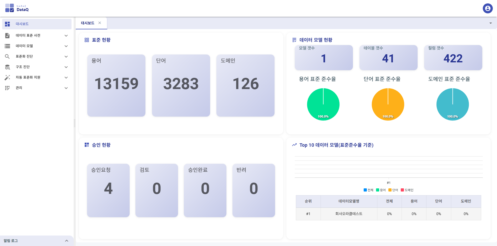

### 3.1 표준 현황

화면 상단에 표준 사전에 등록된 항목의 건수가 카드 형태로 표시됩니다.

| 카드 | 설명 |
|------|------|
| **용어** | 등록된 용어의 총 건수. 클릭하면 용어 관리 화면으로 이동합니다. |
| **단어** | 등록된 단어의 총 건수. 클릭하면 단어 관리 화면으로 이동합니다. |
| **도메인** | 등록된 도메인의 총 건수. 클릭하면 도메인 관리 화면으로 이동합니다. |

### 3.2 데이터 모델 현황

수집된 데이터 모델의 통계 정보가 표시됩니다.

- **모델 갯수:** 등록된 데이터 모델의 총 수
- **테이블 갯수:** 전체 테이블 수
- **컬럼 갯수:** 전체 컬럼 수
- **용어/단어/도메인 표준 준수율:** 각각 파이 차트로 표준에 준수하는 비율과 비준수 비율을 시각적으로 표시

### 3.3 승인 현황

표준 사전 항목의 승인 처리 현황이 카드 형태로 표시됩니다.

| 카드 | 설명 |
|------|------|
| **승인요청** | 승인을 요청한 건수. 클릭하면 승인 화면으로 이동하여 "승인요청" 상태를 필터링합니다. |
| **검토** | 검토 중인 건수. 클릭하면 승인 화면으로 이동합니다. |
| **승인완료** | 승인이 완료된 건수. 클릭하면 승인 화면으로 이동합니다. |

---

## 4. 데이터 표준 사전

데이터 표준 사전은 단어, 용어, 코드, 도메인 등의 표준 메타데이터를 관리하는 메뉴입니다.

---

### 4.1 단어 관리

단어는 데이터 표준의 최소 구성 단위입니다. 용어를 구성하는 기본 요소이며, 각 단어에는 한글명, 영문 약어명, 영문 전체명이 부여됩니다.

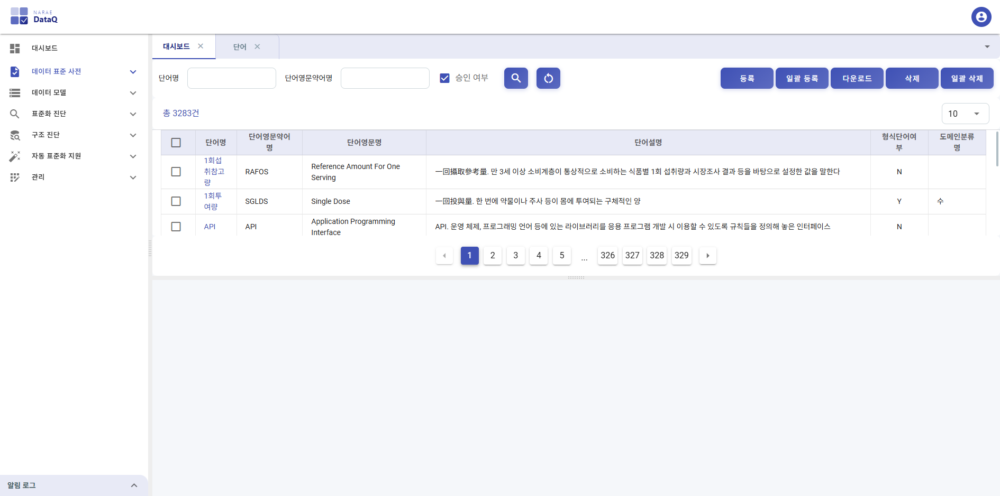

#### 화면 구성

화면은 상하 분할(Split) 구조로 되어 있습니다.

- **상단:** 검색 조건, 버튼 영역, 단어 목록 테이블
- **하단:** 선택한 단어의 상세 정보

#### 검색

| 검색 조건 | 설명 |
|-----------|------|
| **단어명** | 한글 단어명으로 검색합니다. 입력 후 `Enter` 키 또는 검색 버튼을 클릭합니다. |
| **단어영문약어명** | 영문 약어명으로 검색합니다. 자동으로 대문자로 변환됩니다. |
| **승인 여부** | 체크 시 승인된 단어만 조회합니다. |
| **초기화** | 검색 조건을 초기화합니다. |

#### 단어 목록 테이블

| 컬럼 | 설명 |
|------|------|
| 단어명 | 한글 단어명 (클릭 시 하단에 상세 정보 표시) |
| 단어영문약어명 | 영문 약어 (예: PSBLTY) |
| 단어영문명 | 영문 전체명 (예: POSSIBILITY) |
| 단어설명 | 단어의 의미 설명 |
| 형식단어여부 | 도메인 분류에 사용되는 형식 단어 여부 (Y/N) |
| 도메인분류명 | 해당 단어가 속한 도메인 분류 |

- 체크박스로 단어를 선택할 수 있습니다.
- 테이블 아래의 페이지네이션으로 페이지를 이동합니다.
- 테이블 표시 건수(10/20/30/40/50)를 변경할 수 있습니다.

#### 단어 등록

1. **등록** 버튼을 클릭합니다.
2. 등록 다이얼로그에서 다음 항목을 입력합니다.

| 항목 | 필수 | 설명 |
|------|------|------|
| 단어명 | O | 한글 단어명 (예: 가능) |
| 단어 영문 약어명 | O | 영문 약어 (예: PSBLTY). 자동 대문자 변환. 입력 시 중복 여부를 자동 확인합니다. |
| 단어 영문명 | O | 영문 전체명 (예: POSSIBILITY). 자동 대문자 변환. |
| 단어 설명 | O | 단어의 의미 설명 |
| 요청 시스템 | - | 단어 등록을 요청한 시스템 선택 |
| 도메인 분류명 | - | 해당 단어가 속할 도메인 분류 선택 |
| 형식 단어 여부 | - | Y 또는 N (기본값 Y) |
| 이음동의어 목록 | - | 같은 의미의 다른 단어 (추가/삭제 버튼으로 여러 개 입력 가능) |
| 금칙어 목록 | - | 사용을 금지할 단어 (추가/삭제 버튼으로 여러 개 입력 가능) |
| 공통표준여부 | - | Y 또는 N |
| 제정차수 | - | 표준 제정 차수 (예: 1차) |

3. **등록** 버튼을 클릭하여 저장합니다.

#### 엑셀 일괄 등록

1. **일괄 등록** 버튼을 클릭합니다.
2. 파일 선택 다이얼로그에서 `.xlsx` 형식의 엑셀 파일을 선택합니다.
3. 엑셀 파일의 데이터가 일괄로 등록됩니다.

#### 엑셀 다운로드

1. **다운로드** 버튼을 클릭하면 현재 조회된 단어 목록을 엑셀 파일로 다운로드합니다.

#### 단어 수정

1. 단어 목록에서 단어명을 클릭하여 하단 상세 보기에 정보를 표시합니다.
2. 하단의 **수정** 버튼을 클릭합니다.
3. 수정 다이얼로그에서 필요한 항목을 변경합니다.
4. **수정** 버튼을 클릭하여 저장합니다.

#### 단어 삭제

1. 목록에서 삭제할 단어를 체크박스로 선택합니다.
2. **삭제** 버튼을 클릭합니다.
3. 확인 메시지에서 삭제를 확인합니다.

#### 일괄 삭제

- **일괄 삭제** 버튼을 클릭하면 전체 단어를 삭제합니다. 이 기능은 주의하여 사용해야 합니다.

#### 상세 보기

단어 목록에서 단어명을 클릭하면 하단에 상세 정보가 표시됩니다.

| 항목 | 설명 |
|------|------|
| 단어명 | 한글 단어명 |
| 단어영문약어명 | 영문 약어 |
| 단어영문명 | 영문 전체명 |
| 단어설명 | 단어의 의미 |
| 형식단어여부 | 도메인 분류용 단어 여부 |
| 도메인분류명 | 소속 도메인 분류 |
| 요청시스템 | 등록 요청 시스템 |
| 이음동의어목록 | 동의어 리스트 |
| 금칙어목록 | 금지어 리스트 |
| 공통표준여부 | 공통 표준 해당 여부 |
| 제정차수 | 표준 제정 차수 |
| 승인여부 | 승인 처리 상태 |
| 승인상태수정일시 | 승인 상태가 변경된 일시 |
| 생성일시 / 생성사용자ID | 최초 등록 정보 |
| 수정일시 / 수정사용자ID | 최종 수정 정보 |

---

### 4.2 용어 관리

용어는 단어들의 조합으로 구성되는 데이터 표준 항목입니다. 각 용어는 하나 이상의 단어로 구성되며, 마지막 단어(형식 단어)에 따라 도메인이 결정됩니다.

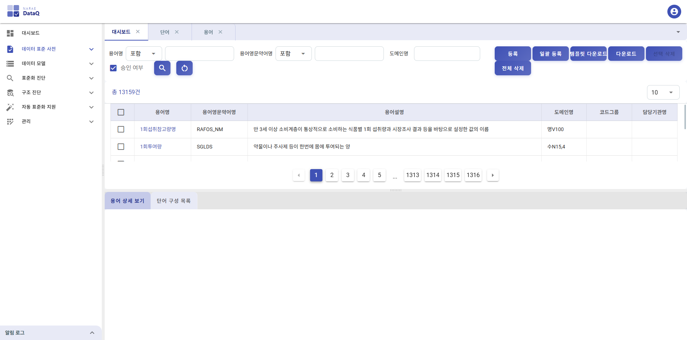

#### 화면 구성

화면은 상하 분할 구조로 되어 있습니다.

- **상단:** 검색 조건, 버튼 영역, 용어 목록 테이블
- **하단:** 탭 형식으로 "용어 상세보기"와 "단어 구성 목록" 표시

#### 검색

| 검색 조건 | 설명 |
|-----------|------|
| **용어명** | 한글 용어명으로 검색합니다. 검색 모드(포함/일치)를 선택할 수 있습니다. |
| **용어영문약어명** | 영문 약어명으로 검색합니다. 자동 대문자 변환. 검색 모드(포함/일치) 선택 가능. |
| **도메인명** | 도메인명으로 필터링합니다. |
| **승인 여부** | 체크 시 승인된 용어만 조회합니다. |
| **초기화** | 검색 조건을 초기화합니다. |

#### 용어 목록 테이블

| 컬럼 | 설명 |
|------|------|
| 용어명 | 한글 용어명 (클릭 시 하단에 상세 정보 표시) |
| 용어영문약어명 | 영문 약어 (단어 약어 조합) |
| 용어설명 | 용어의 의미 설명 |
| 도메인명 | 연결된 도메인명 |
| 코드그룹 | 연결된 코드 그룹 |
| 담당기관명 | 관리 담당 기관 |

#### 용어 등록

1. **등록** 버튼을 클릭합니다.
2. 등록 다이얼로그에서 다음 항목을 입력합니다.

| 항목 | 필수 | 설명 |
|------|------|------|
| 용어명 | O | 한글 용어명 (자동 생성되거나 직접 입력) |
| 용어영문약어명 | O | 영문 약어 (단어 조합에 따라 자동 생성) |
| 용어설명 | O | 용어의 의미 설명 |
| 도메인명 | O | 도메인 선택 |
| 이음동의어 목록 | - | 같은 의미의 다른 용어 |
| 코드그룹 | - | 연결할 코드 그룹 |
| 담당기관명 | - | 관리 담당 기관 |
| 공통표준여부 | - | Y 또는 N |
| 제정차수 | - | 표준 제정 차수 |
| 요청시스템 | - | 등록 요청 시스템 |

- 용어는 단어를 조합하여 생성합니다. 단어 목록 테이블에서 단어를 검색하고 추가하면, 용어명과 영문 약어명이 자동으로 조합됩니다.

3. **등록** 버튼을 클릭하여 저장합니다.

#### 엑셀 일괄 등록 / 다운로드

- **일괄 등록:** 엑셀 파일(.xlsx)을 업로드하여 용어를 일괄 등록합니다.
- **템플릿 다운로드:** 일괄 등록용 엑셀 템플릿 파일을 다운로드합니다.
- **다운로드:** 현재 조회된 용어 목록을 엑셀 파일로 다운로드합니다.

#### 용어 삭제

- **선택 삭제:** 체크박스로 선택한 용어를 삭제합니다. (선택된 항목이 있을 때만 활성화)
- **전체 삭제:** 전체 용어를 삭제합니다. 주의하여 사용하세요.

#### 상세 보기 (탭 1: 용어 상세보기)

용어 목록에서 용어명을 클릭하면 하단에 상세 정보가 표시됩니다.

| 항목 | 설명 |
|------|------|
| 용어명 | 한글 용어명 |
| 용어영문약어명 | 영문 약어 |
| 용어설명 | 의미 설명 |
| 도메인명 | 연결된 도메인 |
| 이음동의어목록 | 동의어 리스트 |
| 코드그룹 | 연결된 코드 |
| 담당기관명 | 관리 기관 |
| 공통표준여부 | 공통 표준 여부 |
| 제정차수 | 제정 차수 |
| 요청시스템 | 요청 시스템 |
| 승인여부 / 승인상태수정일시 | 승인 처리 상태 |
| 생성일시 / 생성사용자ID | 최초 등록 정보 |
| 수정일시 / 수정사용자ID | 최종 수정 정보 |

#### 상세 보기 (탭 2: 단어 구성 목록)

선택한 용어를 구성하는 개별 단어들의 목록이 표시됩니다.

| 컬럼 | 설명 |
|------|------|
| 단어명 | 구성 단어의 한글명 |
| 단어영문약어명 | 구성 단어의 영문 약어 |
| 단어영문명 | 구성 단어의 영문 전체명 |
| 단어설명 | 구성 단어의 설명 |
| 형식단어여부 | 형식 단어 여부 |
| 도메인분류명 | 도메인 분류 |

---

### 4.3 코드 관리

코드는 데이터 항목의 값 목록(코드 값)을 관리하는 기능입니다. 코드 정보와 코드 항목(코드 데이터)으로 구분됩니다.

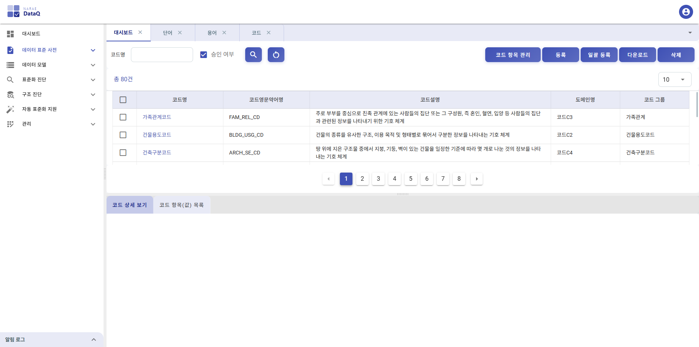

#### 화면 구성

- **상단:** 검색, 버튼, 코드 목록
- **하단:** 탭 형식으로 "코드 상세보기"와 "코드 항목 목록" 표시

#### 검색

| 검색 조건 | 설명 |
|-----------|------|
| **코드명** | 코드명으로 검색합니다. |
| **승인 여부** | 체크 시 승인된 코드만 조회합니다. |
| **초기화** | 검색 조건을 초기화합니다. |

#### 코드 등록

1. **등록** 버튼을 클릭합니다.
2. 코드 정보(코드명, 코드 설명 등)를 입력합니다.
3. **등록** 버튼을 클릭하여 저장합니다.

#### 코드 항목 관리

1. **코드 항목 관리** 버튼을 클릭합니다.
2. 선택한 코드에 대한 코드 값(항목)을 등록/수정/삭제할 수 있습니다.

#### 엑셀 일괄 등록 / 다운로드

- **일괄 등록:** 엑셀 파일(.xlsx)을 업로드하여 코드를 일괄 등록합니다.
- **다운로드:** 현재 조회된 코드 목록을 엑셀 파일로 다운로드합니다.

#### 코드 삭제

1. 목록에서 삭제할 코드를 체크박스로 선택합니다.
2. **삭제** 버튼을 클릭합니다.

#### 상세 보기

- **탭 1 (코드 상세보기):** 선택한 코드의 상세 정보(코드명, 설명 등)
- **탭 2 (코드 항목 목록):** 해당 코드에 속한 코드 값 목록

---

### 4.4 도메인 관리

도메인은 데이터 항목의 데이터 타입, 길이 등의 물리적 속성을 정의하는 표준입니다. 용어의 마지막 단어(형식 단어)에 따라 도메인이 결정됩니다.

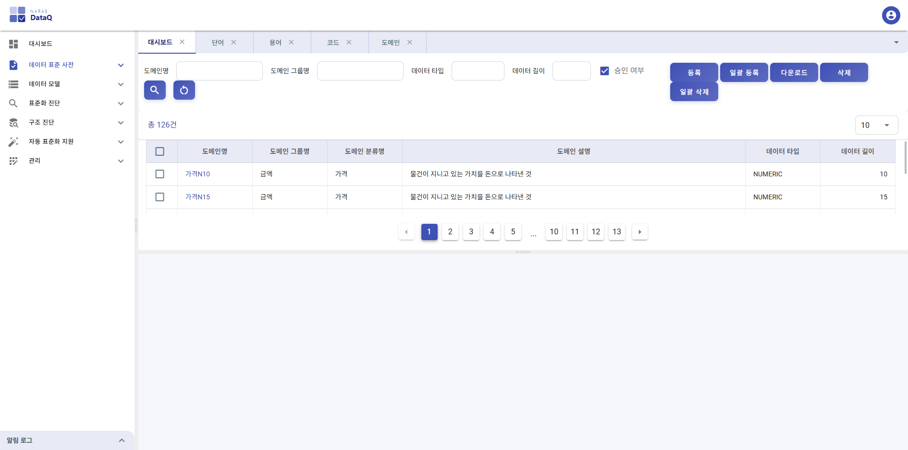

#### 화면 구성

- **상단:** 검색 조건, 버튼 영역, 도메인 목록
- **하단:** 선택한 도메인의 상세 정보

#### 검색

| 검색 조건 | 설명 |
|-----------|------|
| **도메인명** | 도메인명으로 검색합니다. |
| **도메인 그룹명** | 도메인 그룹명으로 필터링합니다. |
| **데이터 타입** | 데이터 타입으로 필터링합니다. (예: VARCHAR, NUMBER) |
| **데이터 길이** | 데이터 길이로 필터링합니다. |
| **승인 여부** | 체크 시 승인된 도메인만 조회합니다. |
| **초기화** | 검색 조건을 초기화합니다. |

#### 도메인 등록

1. **등록** 버튼을 클릭합니다.
2. 등록 다이얼로그에서 다음 항목을 입력합니다.

| 항목 | 필수 | 설명 |
|------|------|------|
| 도메인명 | O | 도메인명 (예: 금액, 일자코드, 명) |
| 도메인 그룹명 | - | 소속 도메인 그룹 |
| 데이터 타입 | O | 데이터 타입 (예: VARCHAR, NUMBER, DATE) |
| 데이터 길이 | - | 데이터 길이 (예: 10, 100) |
| 도메인 설명 | - | 도메인의 용도 설명 |

3. **등록** 버튼을 클릭하여 저장합니다.

#### 엑셀 일괄 등록 / 다운로드

- **일괄 등록:** 엑셀 파일(.xlsx)을 업로드하여 도메인을 일괄 등록합니다.
- **다운로드:** 현재 조회된 도메인 목록을 엑셀 파일로 다운로드합니다.

#### 도메인 삭제

- **삭제:** 체크박스로 선택한 도메인을 삭제합니다.
- **일괄 삭제:** 전체 도메인을 삭제합니다.

---

### 4.5 도메인 그룹

도메인 그룹은 유사한 도메인들을 논리적으로 묶어 관리하는 기능입니다.

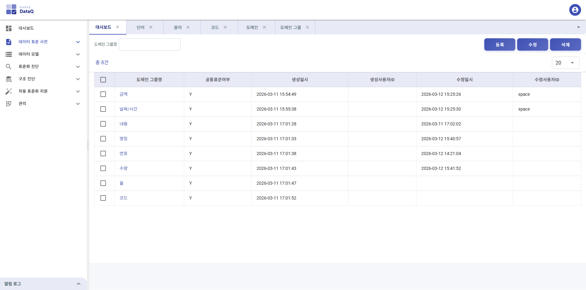

#### 화면 구성

- 검색, 등록/수정/삭제 버튼, 도메인 그룹 목록 테이블

#### 도메인 그룹 등록

1. **등록** 버튼을 클릭합니다.
2. 다음 항목을 입력합니다.

| 항목 | 필수 | 설명 |
|------|------|------|
| 도메인 그룹명 | O | 그룹명 (예: 금액) |
| 공통표준여부 | - | Y 또는 N |

3. **등록** 버튼을 클릭하여 저장합니다.

#### 도메인 그룹 수정/삭제

- 목록에서 그룹을 선택한 후 **수정** 또는 **삭제** 버튼을 클릭합니다.

---

### 4.6 도메인 분류

도메인 분류는 형식 단어(분류 단어)와 도메인 간의 매핑을 관리합니다. 형식 단어가 포함된 용어에 자동으로 도메인을 연결하는 데 사용됩니다.

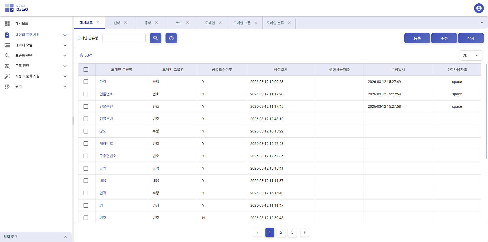

---

### 4.7 변경 이력

단어, 용어, 도메인, 코드 등 표준 사전 항목의 모든 변경 이력을 조회할 수 있습니다.

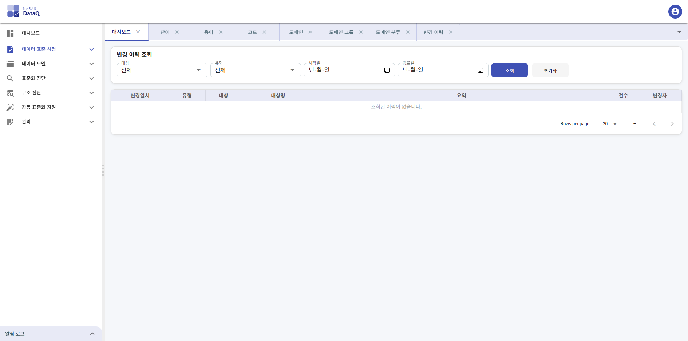

#### 검색 조건

| 필터 | 설명 |
|------|------|
| **대상** | 변경 대상 유형 (전체/단어/용어/도메인/코드/코드데이터) |
| **유형** | 변경 유형 (전체/등록/수정/삭제/일괄등록) |
| **시작일 / 종료일** | 조회 기간 설정 (날짜 선택) |

- **조회** 버튼을 클릭하여 필터 조건에 맞는 이력을 조회합니다.
- **초기화** 버튼으로 필터를 초기 상태로 되돌립니다.

#### 변경 이력 목록

| 컬럼 | 설명 |
|------|------|
| 변경일시 | 변경이 발생한 일시 |
| 유형 | 등록(INSERT), 수정(UPDATE), 삭제(DELETE), 일괄등록(BULK_INSERT) |
| 대상 | 단어, 용어, 도메인, 코드, 코드데이터 |
| 대상명 | 변경된 항목의 이름 |
| 요약 | 변경 내용 요약 |
| 건수 | 일괄 등록의 경우 처리 건수 |
| 변경자 | 변경을 수행한 사용자 ID |

#### 변경 상세

목록에서 행을 클릭하면 하단에 변경 상세 정보가 표시됩니다.

- **개별 변경 (등록/수정/삭제):** 이전값과 변경값을 좌우 비교 형태로 표시합니다.
- **일괄 등록:** 상세 건 목록(순번, 대상명, 상태, 비고)이 테이블로 표시되며, 각 건의 처리 결과(SUCCESS/SKIPPED/ERROR)를 확인할 수 있습니다.

---

## 5. 데이터 모델

DBMS에서 테이블/컬럼 메타데이터를 수집하고 관리하는 기능입니다.

---

### 5.1 데이터 모델 현황

수집된 데이터 모델의 전체 현황을 조회합니다.

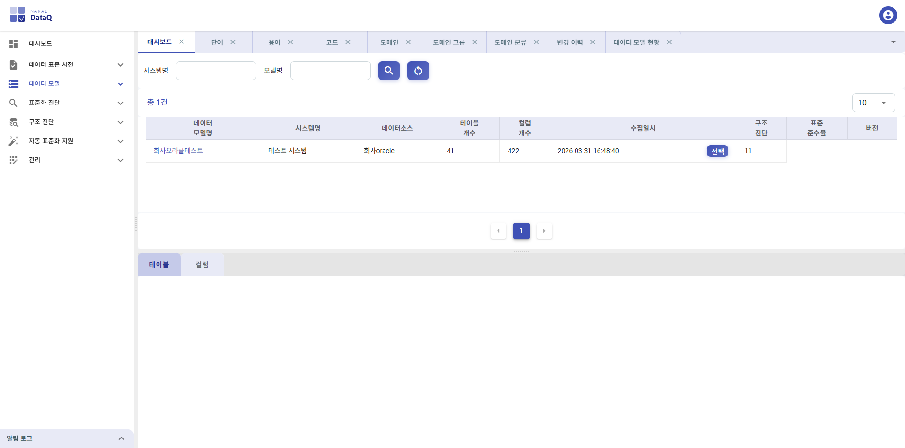

#### 검색

| 검색 조건 | 설명 |
|-----------|------|
| **시스템명** | 시스템명으로 검색합니다. |
| **모델명** | 데이터 모델명으로 검색합니다. |
| **초기화** | 검색 조건을 초기화합니다. |

#### 데이터 모델 현황 테이블

| 컬럼 | 설명 |
|------|------|
| 데이터모델명 | 모델명 (클릭 시 상세 정보 표시) |
| 시스템명 | 소속 시스템 |
| 데이터소스 | 연결된 데이터 소스 |
| 테이블 개수 | 수집된 테이블 수 |
| 컬럼 개수 | 수집된 컬럼 수 |
| 수집일시 | 최근 수집 일시. **선택** 버튼으로 이전 수집 이력을 선택할 수 있습니다. |
| 구조 진단 | 구조 진단 수행 여부 및 결과 (일치/불일치/미진단) |
| 표준화 진단 | 표준 준수율 (%, 칩 형태로 표시) |

---

### 5.2 데이터 모델 수집

DBMS에 접속하여 테이블/컬럼 메타데이터를 수집합니다.

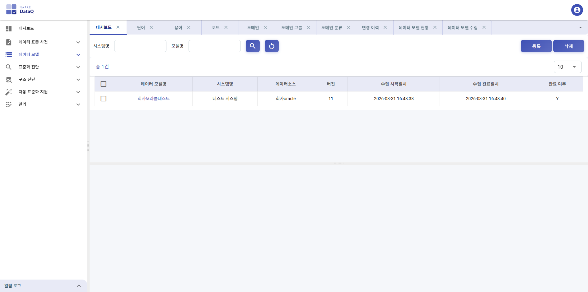

#### 화면 구성

- **상단:** 검색, 등록/삭제 버튼, 데이터 모델 목록
- **하단:** 선택한 모델의 상세 정보 및 수집 실행

#### 검색

| 검색 조건 | 설명 |
|-----------|------|
| **시스템명** | 시스템명으로 검색합니다. |
| **모델명** | 모델명으로 검색합니다. |

#### 데이터 모델 등록

1. **등록** 버튼을 클릭합니다.
2. 데이터 모델 정보(모델명, 시스템, 데이터 소스 등)를 입력합니다.
3. **등록** 버튼으로 저장합니다.

#### 데이터 모델 수집 실행

1. 목록에서 수집할 데이터 모델을 클릭합니다.
2. 하단 상세 보기에서 **수집** 버튼을 클릭합니다.
3. 해당 데이터 소스의 DBMS에 접속하여 테이블과 컬럼 정보를 자동으로 수집합니다.
4. 수집이 완료되면 알림 메시지가 표시됩니다.

#### 데이터 모델 수정/삭제

- **수정:** 목록에서 모델을 선택한 후 **수정** 버튼으로 정보를 수정합니다.
- **삭제:** 체크박스로 선택 후 **삭제** 버튼을 클릭합니다.

---

### 5.3 수집 이력

데이터 모델의 수집 이력을 조회합니다.

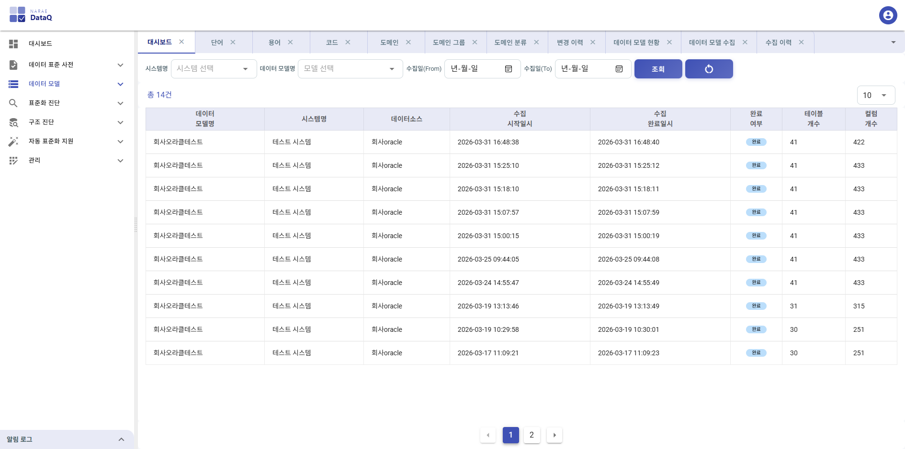

수집이 실행된 일시, 수집 결과(테이블/컬럼 건수), 수집 실행자 등의 정보를 확인할 수 있습니다.

---

## 6. 표준화 진단

수집된 데이터 모델의 컬럼을 표준 사전과 비교하여 표준 준수 여부를 진단합니다.

---

### 6.1 진단 실행

표준화 진단을 실행하는 화면입니다.

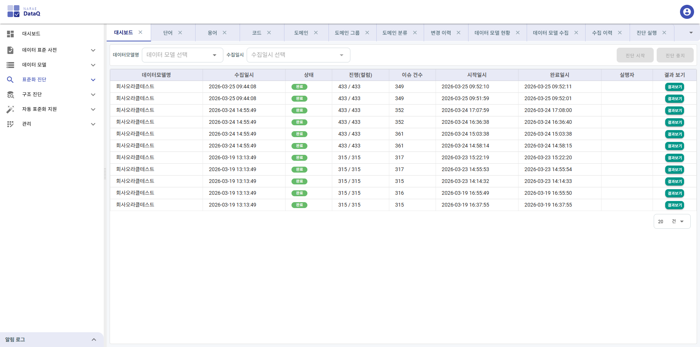

#### 진단 실행 절차

1. **데이터모델명** 드롭다운에서 진단할 데이터 모델을 선택합니다.
2. **수집일시** 드롭다운에서 진단 대상 수집 이력을 선택합니다.
3. **진단 시작** 버튼을 클릭합니다.

#### 진행 상황

진단이 실행되면 다음 정보가 실시간으로 표시됩니다.

- **상태 칩:** 현재 진단 상태 (실행중/완료/오류)
- **진행률 바:** 처리된 컬럼 수 / 전체 컬럼 수
- **이슈 건수:** 현재까지 발견된 이슈 수

진단 중 **진단 중지** 버튼으로 진단을 중단할 수 있습니다.

#### 최근 진단 이력

하단 테이블에 이전 진단 이력이 표시됩니다.

| 컬럼 | 설명 |
|------|------|
| 데이터모델명 | 진단 대상 모델명 |
| 수집일시 | 진단 대상 수집 일시 |
| 상태 | RUNNING(실행중), DONE(완료), ERROR(오류), STOPPED(중지) |
| 진행(컬럼) | 처리 컬럼 수 / 전체 컬럼 수 |
| 이슈 건수 | 발견된 이슈 수 |
| 시작일시 / 완료일시 | 진단 시작과 완료 시간 |
| 실행자 | 진단을 실행한 사용자 |
| 결과 보기 | 완료(DONE) 상태인 경우 **결과보기** 버튼이 표시됩니다. 클릭하면 진단 결과 화면으로 이동합니다. |

---

### 6.2 진단 결과

표준화 진단 결과를 조회하고 분석하는 화면입니다.

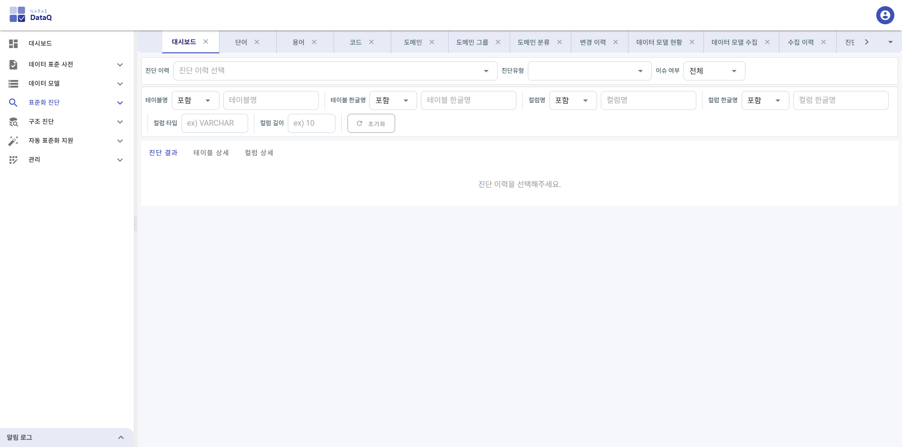

#### 필터 조건

**1행 필터:**

| 필터 | 설명 |
|------|------|
| 진단 이력 | 조회할 진단 이력을 선택합니다. |
| 진단유형 | 이슈 유형을 필터링합니다 (복수 선택 가능): 용어 미존재, 한글명 불일치, 타입 불일치, 길이 불일치 |
| 이슈 여부 | 이슈가 있는 항목만 또는 전체 항목 표시 |

**2행 필터:**

| 필터 | 설명 |
|------|------|
| 테이블명 | 테이블 영문명으로 필터 (포함/일치 모드 선택 가능) |
| 테이블 한글명 | 테이블 한글명으로 필터 |
| 컬럼명 | 컬럼 영문명으로 필터 |
| 컬럼 한글명 | 컬럼 한글명으로 필터 |
| 컬럼 타입 | 데이터 타입으로 필터 (예: VARCHAR) |
| 컬럼 길이 | 데이터 길이로 필터 |

#### 진단 결과 탭

**탭 1: 진단 결과 (요약)**

진단 이력을 선택하면 다음 3가지 카드가 표시됩니다.

| 카드 | 내용 |
|------|------|
| **진단 정보** | 데이터모델명, 수집일시, 진단일시, 실행자 |
| **표준 준수율** | 원형 차트로 준수율(%)을 시각화. 전체 컬럼 중 준수 컬럼 수 표시 |
| **전체 현황** | 전체 테이블/컬럼 수, 이슈 테이블/컬럼 수, 총 이슈 건수 |

하단에는 다음 2개 카드가 표시됩니다.

| 카드 | 내용 |
|------|------|
| **이슈 유형별 분석** | 각 이슈 유형별 건수, 비율, 분포 막대 차트 |
| **이슈 TOP 5 테이블** | 이슈가 가장 많은 테이블 상위 5개 |

**탭 2: 테이블 상세**

테이블별 이슈 현황을 표시합니다.

| 컬럼 | 설명 |
|------|------|
| 테이블명 | 테이블 영문명 |
| 테이블 한글명 | 테이블 한글명 |
| 이슈 컬럼 | 이슈가 있는 컬럼 수 |
| 총 이슈 | 해당 테이블의 총 이슈 건수 |
| 용어 미존재 / 한글명 불일치 / 타입 불일치 / 길이 불일치 | 각 유형별 이슈 건수 |

**탭 3: 컬럼 상세**

컬럼 단위의 상세 진단 결과를 표시합니다.

| 컬럼 | 설명 |
|------|------|
| 테이블명 | 테이블 영문명 |
| 테이블 한글명 | 테이블 한글명 |
| 컬럼 영문명 | 컬럼 영문명 |
| 컬럼 한글명 | 컬럼 한글명 |
| 컬럼 타입 | 실제 데이터 타입 |
| 컬럼 길이 | 실제 데이터 길이 |
| 표준 한글명 | 표준에 정의된 한글명 |
| 표준 타입 | 표준에 정의된 데이터 타입 |
| 표준 길이 | 표준에 정의된 데이터 길이 |
| 진단결과 | 이슈 유형 칩 (용어 미존재/한글명 불일치/타입 불일치/길이 불일치) |
| 액션 | 용어 등록, 코멘트 생성 등의 액션 버튼 |

#### 진단 이슈 유형

| 이슈 유형 | 설명 |
|-----------|------|
| **용어 미존재** | 컬럼의 영문명에 해당하는 표준 용어가 사전에 등록되어 있지 않음 |
| **한글명 불일치** | 컬럼의 한글명이 표준 용어의 한글명과 일치하지 않음 |
| **타입 불일치** | 컬럼의 데이터 타입이 표준 도메인의 타입과 일치하지 않음 |
| **길이 불일치** | 컬럼의 데이터 길이가 표준 도메인의 길이와 일치하지 않음 |

#### 용어 빠른 등록

진단 결과에서 "용어 미존재" 이슈가 있는 컬럼에 대해 빠르게 용어를 등록할 수 있습니다. 액션 컬럼의 버튼을 클릭하면 단어 분석 및 용어 등록 다이얼로그가 표시됩니다.

#### 코멘트 생성

컬럼의 한글명(코멘트)이 표준과 불일치하는 경우, 표준에 맞는 COMMENT ON SQL 스크립트를 생성할 수 있습니다. 일괄 선택 후 코멘트를 일괄 생성하는 것도 가능합니다.

---

## 7. 구조 진단

수집된 데이터 모델 스냅샷과 실제 DBMS의 현재 스키마를 비교하여 구조적 변경사항을 감지합니다.

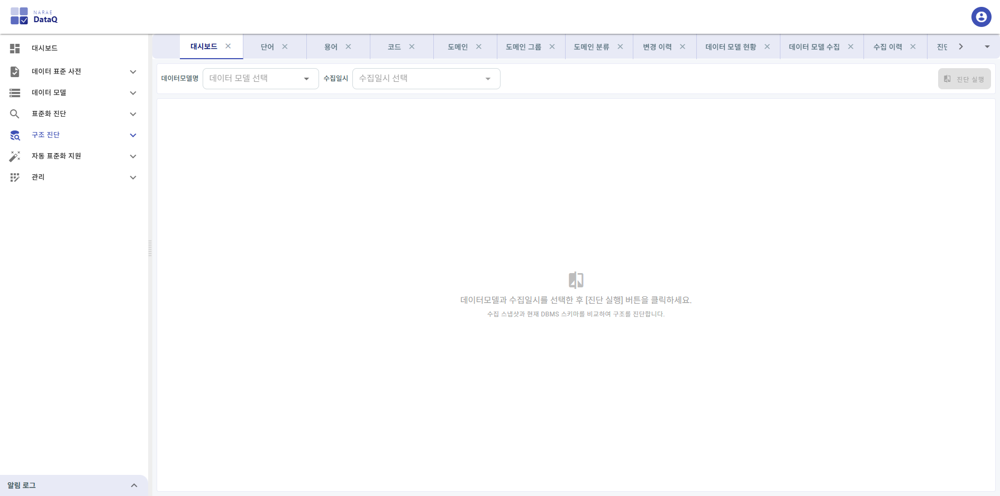

#### 진단 실행 절차

1. **데이터모델명** 드롭다운에서 진단할 데이터 모델을 선택합니다.
2. **수집일시** 드롭다운에서 비교 기준이 될 수집 이력을 선택합니다.
3. **구조 진단 실행** 버튼을 클릭합니다.
4. 시스템이 DBMS에 접속하여 현재 스키마를 조회하고, 수집 스냅샷과 비교합니다.

#### 진단 결과

진단 완료 후 다음 정보가 표시됩니다.

**요약 카드 (4개):**

| 카드 | 설명 |
|------|------|
| 전체 테이블 | 비교 대상 전체 테이블 수 |
| 전체 컬럼 | 비교 대상 전체 컬럼 수 |
| 변경 항목 | 추가/변경/삭제된 항목의 총 수 |
| 비교 기준 | "최초 진단" 또는 "이전 수집 대비" |

**변경 요약 칩:**

- 추가: 추가된 테이블/컬럼 수
- 변경: 변경된 컬럼 수 (타입, 길이 등)
- 삭제: 삭제된 테이블/컬럼 수

**변경사항 테이블:**

필터 칩(전체/추가/변경/삭제)으로 변경 유형별로 필터링할 수 있습니다.

| 컬럼 | 설명 |
|------|------|
| 변경유형 | ADDED(추가), MODIFIED(변경), DELETED(삭제) |
| 테이블명 | 변경된 테이블명 |
| 컬럼명 | 변경된 컬럼명 |
| 이전 타입 | 변경 전 데이터 타입/길이 |
| 현재 타입 | 변경 후 데이터 타입/길이 |

변경사항이 없는 경우 "이전 수집 대비 변경사항이 없습니다" 메시지가 표시됩니다.

---

## 8. 자동 표준화 지원

한글 컬럼명을 입력하면 자동으로 단어를 분리하고, 영문 약어를 추천하며, 도메인을 매핑하여 표준 용어와 단어를 등록하는 기능입니다.

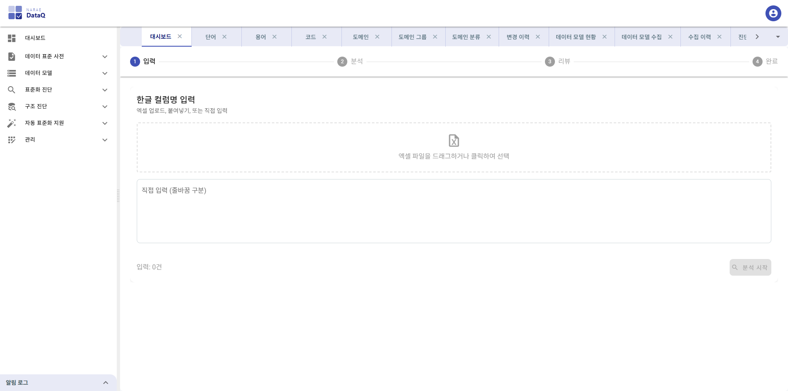

#### 처리 단계 (스텝)

표준화 추천은 4단계로 진행됩니다.

**Step 1: 입력**

한글 컬럼명을 다음 3가지 방법으로 입력할 수 있습니다.

1. **엑셀 파일 업로드:** 엑셀 파일(.xlsx, .xls, .csv)을 드래그 앤 드롭하거나 클릭하여 선택합니다.
2. **붙여넣기:** 텍스트 영역에 한글명을 줄바꿈으로 구분하여 붙여넣습니다.
3. **직접 입력:** 텍스트 영역에 한글명을 줄바꿈으로 구분하여 직접 입력합니다.

입력 예시:
```
기준일자
사용자코드명
월별정산금액
```

입력한 건수가 표시되며, **분석 시작** 버튼을 클릭하면 다음 단계로 진행합니다.

**Step 2: 분석**

시스템이 입력된 한글명을 분석합니다. 진행 상황이 로딩 인디케이터로 표시됩니다.

- 각 한글명을 단어 사전 기반으로 단어를 분리합니다.
- 각 단어에 대해 영문 약어를 매핑합니다.
- 마지막 단어(형식 단어)를 기반으로 도메인을 추천합니다.
- 기존에 등록된 용어인지 확인합니다.

**Step 3: 리뷰**

분석 결과를 리뷰하고 수정할 수 있습니다.

상단에 분석 결과 요약 칩이 표시됩니다.

| 칩 | 설명 |
|----|------|
| 전체 | 전체 분석 건수 |
| 기등록 | 이미 표준 사전에 등록된 용어 |
| 자동완성 | 모든 단어가 매칭되어 자동으로 용어를 구성할 수 있는 건 |
| 부분매칭 | 일부 단어만 매칭되어 수동 확인이 필요한 건 |
| 미매칭 | 매칭되는 단어가 없어 수동 등록이 필요한 건 |

필터 칩으로 특정 상태만 필터링할 수 있습니다.

리뷰 테이블 컬럼:

| 컬럼 | 설명 |
|------|------|
| 입력 한글명 | 사용자가 입력한 원본 한글명 |
| 상태 | 기등록/자동완성/부분매칭/미매칭 |
| 분리된 단어 | 분리된 단어 목록 (칩 형태, 신규 단어는 주황색) |
| 추천 영문약어명 | 조합된 영문 약어명 |
| 추천 도메인 | 추천된 도메인 (후보가 여러 개인 경우 드롭다운 선택 가능) |
| 타입/길이 | 추천 도메인의 데이터 타입과 길이 |
| 액션 | 승인/수정 버튼 |

- **수정** 버튼: 부분매칭/미매칭 항목의 단어를 수동으로 수정할 수 있는 다이얼로그를 엽니다.
- **승인** 버튼: 해당 항목을 등록 대상으로 확정합니다.
- **전체 승인** 버튼: 자동완성된 모든 항목을 일괄 승인합니다.
- **등록 실행** 버튼: 승인된 항목의 신규 단어와 용어를 표준 사전에 일괄 등록합니다.

**Step 4: 완료**

등록 결과가 표시됩니다.

- 등록된 단어 수, 등록된 용어 수, 스킵 수, 실패 수가 칩으로 표시됩니다.

추가로 **DDL 생성** 기능을 제공합니다.

1. DBMS 유형(ORACLE/POSTGRESQL/MYSQL)을 선택합니다.
2. 테이블명을 입력합니다.
3. **DDL 생성** 버튼을 클릭하면 CREATE TABLE DDL 스크립트가 생성됩니다.
4. **복사** 버튼으로 클립보드에 복사할 수 있습니다.

---

## 9. 관리

시스템 관리 기능입니다.

---

### 9.1 사용자 관리

시스템 사용자를 등록하고 관리합니다.


사용자의 ID, 이름, 역할, 상태 등을 관리합니다.

---

### 9.2 승인

표준 사전 항목(단어, 용어, 도메인, 코드)의 승인 처리를 관리합니다.

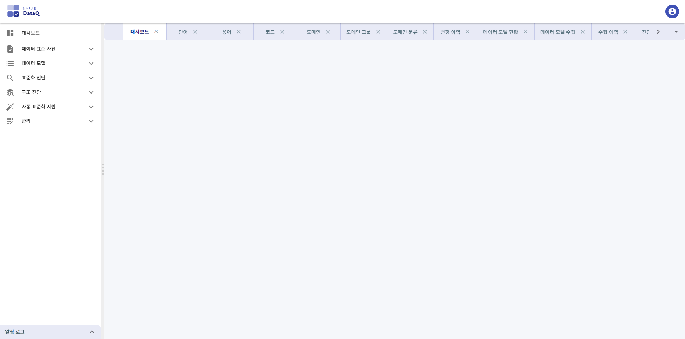

#### 승인 워크플로

1. **승인요청 (REQUESTED):** 표준 항목이 등록/수정되면 승인 요청 상태가 됩니다.
2. **검토 (CHECKING):** 관리자가 요청 내용을 검토합니다.
3. **승인완료 (APPROVED):** 검토가 완료되면 승인을 완료합니다.

승인 상태별로 필터링하여 조회할 수 있으며, 대시보드의 승인 현황 카드를 클릭하면 해당 상태로 필터링된 승인 화면으로 이동합니다.

---

### 9.3 데이터 소스

DBMS 접속 정보를 관리합니다. 데이터 모델 수집 및 구조 진단 시 사용됩니다.


데이터 소스 등록 시 다음 정보를 입력합니다.

| 항목 | 설명 |
|------|------|
| 데이터 소스명 | 식별용 이름 |
| DBMS 유형 | Oracle, PostgreSQL, MySQL, Tibero 등 |
| 호스트 / 포트 | DBMS 서버 주소 및 포트 번호 |
| 데이터베이스명 / SID | 접속할 데이터베이스명 또는 SID |
| 사용자명 / 비밀번호 | DBMS 접속 계정 정보 |
| 스키마 | 수집 대상 스키마명 |

접속 테스트 기능으로 입력한 정보의 유효성을 검증할 수 있습니다.

---

### 9.4 시스템 정보

업무 시스템 정보를 관리합니다. 데이터 모델이 속한 시스템을 정의합니다.


시스템명, 시스템 코드, 설명 등의 정보를 등록하고 관리합니다.

---

## 부록: 용어 정리

| 용어 | 설명 |
|------|------|
| **단어** | 데이터 표준의 최소 구성 단위. 한글명과 영문 약어명이 1:1로 매핑됨 (예: 가능 = PSBLTY) |
| **용어** | 단어의 조합으로 구성된 데이터 항목의 표준명 (예: 가능여부 = PSBLTY_YN) |
| **형식 단어** | 용어의 마지막에 오는 단어로, 도메인 분류를 결정하는 역할 (예: 일자, 금액, 코드, 명) |
| **도메인** | 데이터 항목의 물리적 속성(데이터 타입, 길이)을 정의하는 표준 (예: 일자 = VARCHAR(8)) |
| **도메인 그룹** | 유사한 도메인을 논리적으로 묶은 그룹 (예: 금액 그룹) |
| **도메인 분류** | 형식 단어와 도메인 간의 매핑 규칙 |
| **데이터 모델** | 특정 DBMS의 테이블/컬럼 구조를 수집한 메타데이터 집합 |
| **표준 준수율** | 전체 컬럼 중 표준 용어에 부합하는 컬럼의 비율 |
| **이음동의어** | 같은 의미를 가진 다른 표현의 단어 |
| **금칙어** | 사용을 금지하는 비표준 단어 |

---

*본 매뉴얼은 Narae DataQ v1.0 기준으로 작성되었습니다.*
