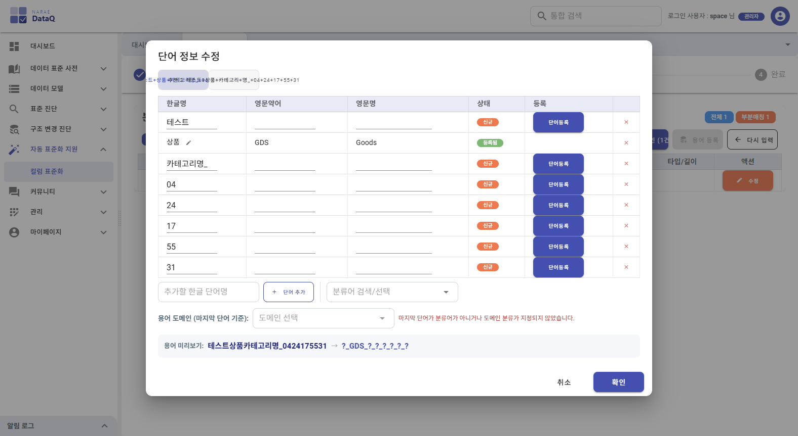
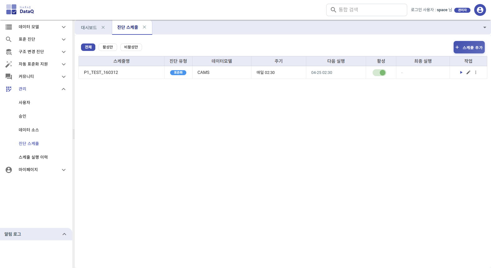
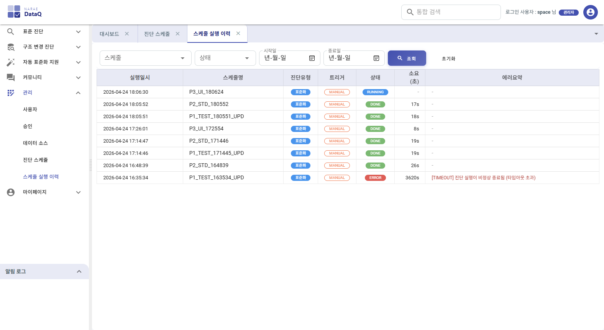

# Narae DataQ 사용자 매뉴얼

**버전:** 2.3
**최종 수정일:** 2026-05-26
**제품명:** Narae DataQ - 데이터 품질 관리 플랫폼

> **2.3 갱신 요약** — 2.1 (2026-05-05) 이후 반영된 주요 변경:
> - **88번 데이터 모델 거버넌스** (2026-05-14) — DRAFT/SUBMITTED/APPROVED/REJECTED 상태머신, 사용자 [내 변경 신청] → 관리자 [데이터 모델 변경 승인], Tier 1/1.5/2 변경 분류 (13장 신설)
> - **데이터 모델 시각화** — ERD 자동 생성, PNG/PDF export (5.9절 신설)
> - **모델링 도구 임포트** — ERwin native XML / XMI 2.1 임포트 (5.8절 신설)
> - **한글 변환 이력** — 한글컬럼 일괄 표준화 결과 매핑 정의서 (8.2절 신설)
> - **영역 관리** — 업무영역 / 주제영역 CRUD + 테이블 매핑 (12.4절 신설)
> - **표준 진단 강화** — 영문명+한글명+도메인 통합 검증, 진단 종료 시 flag 자동 동기화 (6.3절 신설)
> - **테이블 일괄 삭제** — 선택 / 검색결과 전체 (5.4절 갱신)
> - **테이블 엑셀 업로드 완화** — 영문/한글 둘 중 하나만 있어도 등록 가능
> - **메뉴명 풀네임화** — "승인" → "표준 사전 변경 승인", "요청 현황" → "표준 사전 변경 요청 현황"
> - **데이터 품질 진단 메뉴 비활성** — 영업 라인업 분리 결정 (2026-05-13) 으로 메뉴 주석. 표준화/구조 진단만 운영
>
> **2.1 갱신 요약** — 2.0 (2026-04-24) 이후 반영된 주요 변경:
> - 진단 제외 관리 (79번) 신규 — 표준/구조/품질 진단 대상에서 OBJ/ATTR 단위 제외, cascade + 사유 (5.10절)
> - 자동 표준화 지원 — "분류어" → "형식단어" 가시 텍스트 통일 (행안부 지침), 알고리즘 보강 (DP 점수, 동의어 cascade, 미신뢰 토큰 재검색)
> - 일괄등록 양식 — 5종 정적 XLSX (단어/용어/도메인/테이블/컬럼)
>
> **2.0 갱신 요약** — v1.0 (2026-04-01) 이후 반영된 주요 변경:
> - 데이터모델 CLCT 폐기 및 컬럼 그리드 인라인 편집 재설계 (53번 문서)
> - 컬럼 입력 3가지 경로: 그리드 직접 / TSV 붙여넣기 / 엑셀 업로드
> - 데이터모델 DDL 다운로드 (Oracle/Postgres)
> - 자동 표준화 지원 모달 — 형식단어 autocomplete + 도메인 cascade
> - 메뉴 "데이터 모델 수집" → "데이터 모델 관리" (라벨만, 라우팅 키 유지)
> - 진단 스케줄러 신규 (관리 메뉴 하위 2개)
> - 승인 — cascade 반려 + 단어 선승인 정책
> - 데이터소스 — Oracle SID/Service Name 양쪽 지원
> - 시스템 개념 전체 제거

---

## 목차

1. [Narae DataQ 개요](#1-narae-dataq-개요)
2. [로그인](#2-로그인)
3. [메인 화면 (대시보드)](#3-메인-화면-대시보드)
4. [데이터 표준 사전](#4-데이터-표준-사전)
   - 4.1 [단어 관리](#41-단어-관리)
   - 4.2 [용어 관리](#42-용어-관리)
   - 4.3 [코드 관리](#43-코드-관리)
   - 4.4 [도메인 관리](#44-도메인-관리)
   - 4.5 [도메인 그룹](#45-도메인-그룹)
   - 4.6 [도메인 분류](#46-도메인-분류)
   - 4.7 [변경 이력](#47-변경-이력)
5. [데이터 모델](#5-데이터-모델)
   - 5.1 [데이터 모델 관리 (수집)](#51-데이터-모델-관리-수집)
   - 5.2 [데이터 모델 현황 (DDL 다운로드)](#52-데이터-모델-현황-ddl-다운로드)
   - 5.3 [데이터 모델 수집이력](#53-데이터-모델-수집이력)
   - 5.4 [테이블](#54-테이블)
   - 5.5 [컬럼](#55-컬럼)
   - 5.6 [인덱스](#56-인덱스)
   - 5.7 [제약조건](#57-제약조건)
   - 5.8 [모델링 도구 임포트 (ERwin XML / XMI)](#58-모델링-도구-임포트-erwin-xml--xmi)
   - 5.9 [데이터 모델 시각화 (ERD)](#59-데이터-모델-시각화-erd)
   - 5.10 [진단 제외 관리](#510-진단-제외-관리)
   - 5.11 [내 변경 신청 (88번 거버넌스)](#511-내-변경-신청-88번-거버넌스)
   - 5.12 [데이터 모델 변경 이력](#512-데이터-모델-변경-이력)
6. [표준 진단](#6-표준-진단)
   - 6.1 [진단 실행](#61-진단-실행)
   - 6.2 [진단 결과](#62-진단-결과)
   - 6.3 [진단 후 자동 flag 동기화 (sync)](#63-진단-후-자동-flag-동기화-sync)
7. [구조 변경 진단](#7-구조-변경-진단)
8. [표준화 도구](#8-표준화-도구)
   - 8.1 [한글컬럼 일괄 표준화](#81-한글컬럼-일괄-표준화)
   - 8.2 [한글 변환 이력](#82-한글-변환-이력)
9. [커뮤니티](#9-커뮤니티)
10. [스케줄 관리](#10-스케줄-관리)
11. [마이페이지](#11-마이페이지)
12. [관리 (관리자 전용)](#12-관리-관리자-전용)
    - 12.1 [사용자](#121-사용자)
    - 12.2 [표준 사전 변경 승인](#122-표준-사전-변경-승인)
    - 12.3 [데이터 모델 변경 승인](#123-데이터-모델-변경-승인)
    - 12.4 [영역 관리 (업무/주제)](#124-영역-관리-업무주제)
    - 12.5 [데이터 소스](#125-데이터-소스)
13. [데이터 모델 거버넌스 워크플로 (88번)](#13-데이터-모델-거버넌스-워크플로-88번)
- [부록 A. 용어 정리](#부록-a-용어-정리)
- [부록 B. v2.3 갱신 상세 (2026-05-26 작업분)](#부록-b-v23-갱신-상세-2026-05-26-작업분)

---

## 1. Narae DataQ 개요

### 1.1 제품 소개

Narae DataQ 는 **데이터 품질 관리 플랫폼**입니다. 기관·기업의 데이터 표준을 체계적으로 관리하고, DBMS 에서 수집한 실제 데이터 모델을 표준 사전과 비교하여 표준화 준수율을 측정·진단합니다.

표준 용어·단어·도메인·코드 사전을 통합 관리하며, AI 기반의 자동 표준화 추천 기능으로 신규 컬럼에 대한 표준 용어를 자동 생성할 수 있습니다. v2.3 부터는 데이터 모델 변경에 대한 거버넌스(승인 워크플로 + 변경 이력 + DB 직접 반영) 기능이 추가되었습니다.

### 1.2 주요 기능

| 기능 | 설명 |
|------|------|
| **데이터 표준 사전** | 단어·용어·코드·도메인·도메인 그룹·도메인 분류의 등록/수정/삭제/조회 및 엑셀 일괄 등록 |
| **데이터 모델 관리** | DBMS 접속을 통한 테이블·컬럼·인덱스·제약조건 메타데이터 자동 수집 및 현황 조회 |
| **모델링 도구 임포트** | ERwin native XML / XMI 2.1 형식 임포트 (DBMS 접속 없이 모델 등록) |
| **데이터 모델 시각화** | ERD 자동 생성, 업무영역 기반 필터·레이아웃, PNG/PDF export |
| **표준 진단** | 수집된 데이터 모델의 컬럼을 표준 사전과 비교하여 용어 미존재·한글명 불일치·타입 불일치·길이 불일치 이슈 진단. 진단 종료 시 컬럼별 표준 flag 자동 동기화 |
| **구조 변경 진단** | DBMS 실제 스키마와 수집 스냅샷을 비교하여 테이블·컬럼의 추가/변경/삭제 감지 |
| **자동 표준화 (표준화 도구)** | 한글 컬럼명을 입력하면 단어 분리·영문 약어 추천·도메인 매핑·용어 자동 등록 |
| **승인 관리** | 표준 사전 항목 + 데이터 모델 변경 각각의 승인 요청/검토/승인 완료 워크플로 |
| **변경 이력 추적** | 단어/용어/도메인/코드 표준 사전 변경 이력 + 데이터 모델 (테이블·컬럼·인덱스·제약·PK·FK) 변경 이력 모두 누적 보관 |
| **거버넌스 (88번)** | 데이터 모델 변경의 상태 머신(DRAFT/SUBMITTED/APPROVED/REJECTED), Tier 분류(1/1.5/2), 사용자 신청 → 관리자 승인 흐름 |
| **진단 제외 관리 (79번)** | 임시·폐기 테이블/컬럼을 표준·구조·품질 진단 대상에서 제외 (cascade + 사유) |
| **영역 관리** | 업무영역(논리) / 주제영역(물리) CRUD + 테이블 매핑 — 88번 §15 |
| **진단 스케줄러** | 표준 진단·구조 진단의 정기 자동 실행 (관리자) |
| **DDL 다운로드** | 모델 단위 CREATE TABLE + 제약조건 + COMMENT SQL 스크립트 export |

### 1.3 시스템 요구사항

| 항목 | 요구사항 |
|------|----------|
| 웹 브라우저 | Chrome, Edge, Firefox (최신 버전 권장) |
| 화면 해상도 | 1920×1080 이상 권장. 작은 모니터에서는 브라우저 줌(Ctrl + / Ctrl -) 사용 — Edge·Chrome 은 도메인별 자동 저장 |
| 서버 | **Java 1.8 (JDK 8 필수)**, Spring Boot 2.7.x |
| 데이터베이스 | PostgreSQL 13 이상 (운영 메타 저장) |
| 지원 DBMS (수집 대상) | Oracle (SID/Service Name 양쪽), PostgreSQL, MySQL, MariaDB, Tibero, Cubrid, Goldilocks, Altibase, MSSQL 등 (`drivers.xml` 기반) |

### 1.4 메뉴 구조 (v2.3)

좌측 네비게이션은 다음과 같이 구성됩니다.

```
대시보드
데이터 표준 사전
  ├ 용어
  ├ 단어
  ├ 코드
  ├ 도메인
  ├ 도메인 그룹
  ├ 도메인 분류
  └ 변경 이력
데이터 모델
  ├ 테이블
  ├ 컬럼
  ├ 인덱스
  ├ 제약조건
  ├ 데이터 모델 관리                  (구. 데이터 모델 수집)
  ├ 데이터 모델 수집이력
  ├ 데이터 모델 현황                  (DDL 다운로드 포함)
  ├ 모델링 도구 임포트                 ★ 신규 (ERwin XML / XMI 2.1)
  ├ 데이터 모델 시각화                 ★ 신규 (ERD)
  ├ 진단 제외 관리
  ├ 내 변경 신청                       ★ 신규 (88번 거버넌스)
  └ 데이터 모델 변경 이력              ★ 신규 (88번 거버넌스)
표준 진단
  ├ 진단 실행
  └ 진단 결과
구조 변경 진단
  ├ 진단 실행
  └ 진단 결과
표준화 도구                            (구. 자동 표준화 지원)
  ├ 한글컬럼 일괄 표준화                (구. 컬럼 표준화)
  └ 한글 변환 이력                     ★ 신규 (88번 §16)
커뮤니티
  ├ 공지사항
  └ Q&A
스케줄 관리                            (구. 진단 스케줄 그룹 라벨)
  ├ 스케줄 관리
  └ 실행 이력
마이페이지
  ├ 내 정보
  ├ 표준 사전 변경 요청 현황          (구. 요청 현황)
  ├ 내 변경 신청                       (사용자 권한만 노출)
  └ 데이터 모델 변경 승인              (관리자 권한만 노출 — 88번 거버넌스 빠른 접근)
관리 [관리자 전용]
  ├ 사용자
  ├ 표준 사전 변경 승인                (구. 승인)
  ├ 데이터 모델 변경 승인              ★ 신규 (88번 거버넌스)
  ├ 영역 관리 (업무/주제)              ★ 신규 (88번 §15)
  └ 데이터 소스

(비활성 — 영업 라인업 분리 결정 2026-05-13)
데이터 품질 진단                       메뉴 주석 처리 — 복원 시 NdNav.vue 의 해당 블록 주석 해제만 필요
  ├ 도메인 룰 관리
  ├ 값 프로파일링
  ├ 업무 규칙 관리
  ├ 업무 규칙 진단 결과
  ├ 컬럼 규칙 매핑
  └ 진단 통계
```

> **권한 규칙**: "관리" 그룹은 관리자 권한 사용자에게만 노출됩니다 (DOM 자체에 렌더되지 않음 + API 도 403 거부). 마이페이지의 일부 항목도 권한별로 다르게 노출됩니다 (사용자=내 변경 신청 / 관리자=데이터 모델 변경 승인).

### 1.5 권한·역할 모델

| 역할 | 데이터 표준 사전 등록 | 데이터 모델 변경 | 진단 실행 | 승인 처리 | 관리 메뉴 |
|---|---|---|---|---|---|
| **일반 사용자** | 가능 (APRV_YN='N' 으로 등록 → 관리자 승인 대기) | Tier 1 = DRAFT 저장 → 신청 → 관리자 승인 필요 / Tier 2 = 즉시 / Tier 1.5 = UI 차단 | 가능 | 본인 변경 신청 회수만 가능 | ✗ |
| **관리자** | 가능 (APRV_YN='Y' 즉시 승인) | 모든 Tier 즉시 APPROVED | 가능 (스케줄도 등록·실행) | 모든 변경 승인/반려 | ✓ |

---

## 2. 로그인

### 2.1 로그인 화면

시스템에 접속하면 로그인 화면이 표시됩니다.


### 2.2 로그인 절차

1. **아이디** 입력 필드에 사용자 ID 를 입력합니다.
2. **비밀번호** 입력 필드에 비밀번호를 입력합니다.
3. **로그인** 버튼을 클릭하거나, 비밀번호 입력 후 `Enter` 키를 눌러 로그인합니다.

로그인에 실패하면 오류 메시지가 표시됩니다. ID 또는 비밀번호를 확인해 주세요.

### 2.3 비밀번호 변경 / 로그아웃

- 상단 우측 사용자 아이콘을 클릭하면 메뉴가 펼쳐집니다.
- **비밀번호 변경**: 모달이 열리며 현재 비밀번호 + 신규 비밀번호(2회) 입력 후 저장.
- **로그아웃**: 즉시 세션 종료 → 로그인 화면 복귀.

---

## 3. 메인 화면 (대시보드)

로그인 후 가장 먼저 표시되는 화면입니다. 시스템 전체 현황을 한눈에 파악할 수 있습니다.


### 3.1 표준 현황 카드

화면 상단에 표준 사전에 등록된 항목의 건수가 카드 형태로 표시됩니다.

| 카드 | 설명 |
|------|------|
| **용어** | 등록된 용어의 총 건수. 클릭하면 용어 관리 화면으로 이동합니다. |
| **단어** | 등록된 단어의 총 건수. 클릭하면 단어 관리 화면으로 이동합니다. |
| **도메인** | 등록된 도메인의 총 건수. 클릭하면 도메인 관리 화면으로 이동합니다. |

### 3.2 데이터 모델 현황

수집된 데이터 모델의 통계 정보가 표시됩니다.

- **모델 개수**: 등록된 데이터 모델의 총 수
- **테이블 개수**: 전체 테이블 수
- **컬럼 개수**: 전체 컬럼 수
- **용어 / 단어 / 도메인 표준 준수율**: 각각 파이 차트로 표준에 준수하는 비율과 비준수 비율을 시각적으로 표시. v2.3 부터 표준 진단 종료 시점에 자동 동기화되는 flag (TERMS_STND_YN / DOMAIN_STND_YN) 기반.

### 3.3 승인 현황 카드

표준 사전 항목의 승인 처리 현황이 카드 형태로 표시됩니다.

| 카드 | 설명 |
|------|------|
| **승인요청** | 승인을 요청한 건수. 클릭하면 표준 사전 변경 승인 화면으로 이동하여 "승인요청" 상태를 필터링합니다. |
| **검토** | 검토 중인 건수. 클릭하면 승인 화면으로 이동합니다. |
| **승인완료** | 승인이 완료된 건수. |

### 3.4 빠른 액션 (Quick Actions)

대시보드 하단에 자주 사용하는 기능으로 바로 이동하는 카드가 있습니다.

- **한글컬럼 일괄 표준화** — 표준화 도구로 이동
- **표준 진단 실행** — 진단 실행 화면으로 이동
- **구조 변경 진단 실행** — 구조 변경 진단으로 이동

---

## 4. 데이터 표준 사전

데이터 표준 사전은 단어·용어·코드·도메인 등의 표준 메타데이터를 관리하는 메뉴입니다.

---

### 4.1 단어 관리

단어는 데이터 표준의 최소 구성 단위입니다. 용어를 구성하는 기본 요소이며, 각 단어에는 한글명·영문 약어명·영문 전체명이 부여됩니다.


#### 화면 구성

화면은 상하 분할(Split) 구조입니다.

- **상단**: 검색 조건, 버튼 영역, 단어 목록 테이블
- **하단**: 선택한 단어의 상세 정보

#### 검색

| 검색 조건 | 설명 |
|-----------|------|
| **단어명** | 한글 단어명으로 검색합니다. 입력 후 `Enter` 키 또는 검색 버튼을 클릭합니다. |
| **단어영문약어명** | 영문 약어명으로 검색합니다. 자동으로 대문자로 변환됩니다. |
| **승인 여부** | 체크 시 승인된 단어만 조회합니다. |
| **초기화** | 검색 조건을 초기화합니다. |

#### 단어 목록 테이블

| 컬럼 | 설명 |
|------|------|
| 단어명 | 한글 단어명 (클릭 시 하단에 상세 정보 표시) |
| 단어영문약어명 | 영문 약어 (예: PSBLTY) |
| 단어영문명 | 영문 전체명 (예: POSSIBILITY) |
| 단어설명 | 단어의 의미 설명 |
| 형식단어여부 | 도메인 분류에 사용되는 형식 단어 여부 (Y/N) |
| 도메인분류명 | 해당 단어가 속한 도메인 분류 |

- 체크박스로 단어를 선택할 수 있습니다.
- 테이블 아래의 페이지네이션으로 페이지를 이동합니다.
- 테이블 표시 건수(10/20/30/40/50)를 변경할 수 있습니다.
- **v2.3 페이지네이션 개선**: 검색·필터로 데이터가 줄어들어 현재 페이지 번호가 마지막 페이지를 넘으면 자동으로 마지막 페이지로 이동합니다 (이전 버전에서 빈 페이지가 표시되던 버그 fix).

#### 단어 등록

1. **등록** 버튼을 클릭합니다.
2. 등록 다이얼로그에서 다음 항목을 입력합니다.

| 항목 | 필수 | 설명 |
|------|------|------|
| 단어명 | O | 한글 단어명 (예: 가능) |
| 단어 영문 약어명 | O | 영문 약어 (예: PSBLTY). 자동 대문자 변환. 입력 시 중복 여부를 자동 확인합니다. |
| 단어 영문명 | O | 영문 전체명 (예: POSSIBILITY). 자동 대문자 변환. |
| 단어 설명 | O | 단어의 의미 설명 |
| 요청 시스템 | - | 단어 등록을 요청한 시스템 |
| 도메인 분류명 | - | 해당 단어가 속할 도메인 분류 선택 |
| 형식 단어 여부 | - | Y 또는 N (기본 Y) |
| 이음동의어 목록 | - | 같은 의미의 다른 단어 (추가/삭제 버튼) |
| 금칙어 목록 | - | 사용을 금지할 단어 (추가/삭제 버튼) |
| 공통표준여부 | - | Y 또는 N |
| 제정차수 | - | 표준 제정 차수 (예: 1차) |

3. **등록** 버튼을 클릭하여 저장합니다. 관리자가 등록 시 `APRV_YN='Y'` 로 즉시 승인되며, 일반 사용자가 등록 시 `APRV_YN='N'` 로 등록되어 관리자 승인을 거쳐야 합니다.

#### 엑셀 일괄 등록 / 다운로드

- **양식 다운로드**: 일괄 등록용 정적 xlsx 양식을 다운로드합니다 (헤더 + 예시 + 가이드 시트 포함).
- **일괄 등록**: 엑셀 파일(.xlsx) 을 업로드하여 단어를 일괄 등록합니다. multipart 업로드.
- **다운로드**: 현재 조회된 단어 목록을 엑셀 파일로 다운로드합니다.

#### 단어 수정 / 삭제

- **수정**: 단어 목록에서 단어명을 클릭 → 하단 상세 패널 → **수정** 버튼.
- **삭제**: 체크박스로 선택 → 상단 **삭제** 버튼. 확인 모달.
- **일괄 삭제**: 전체 단어 삭제 (주의 — 표준 사전 초기화 시에만 사용).

#### 상세 보기

단어 목록에서 단어명을 클릭하면 하단에 상세 정보가 표시됩니다.

| 항목 | 설명 |
|------|------|
| 단어명 / 영문약어명 / 영문명 / 설명 | 핵심 식별 정보 |
| 형식단어여부 / 도메인분류명 | 분류 정보 |
| 이음동의어목록 / 금칙어목록 | 관련어 |
| 요청시스템 / 공통표준여부 / 제정차수 | 출처·관리 정보 |
| 승인여부 / 승인상태수정일시 | 승인 상태 |
| 생성일시 / 생성사용자ID / 수정일시 / 수정사용자ID | 변경 추적 |

---

### 4.2 용어 관리

용어는 단어들의 조합으로 구성되는 데이터 표준 항목입니다. 각 용어는 하나 이상의 단어로 구성되며, 마지막 단어(형식 단어)에 따라 도메인이 결정됩니다.


#### 화면 구성

- **상단**: 검색 조건, 버튼 영역, 용어 목록 테이블
- **하단**: 탭 형식으로 "용어 상세보기" 와 "단어 구성 목록" 표시

#### 검색

| 검색 조건 | 설명 |
|-----------|------|
| **용어명** | 한글 용어명으로 검색합니다. 검색 모드(포함/일치)를 선택할 수 있습니다. |
| **용어영문약어명** | 영문 약어명으로 검색합니다. 자동 대문자 변환. 검색 모드(포함/일치) 선택 가능. |
| **도메인명** | 도메인명으로 필터링합니다. |
| **승인 여부** | 체크 시 승인된 용어만 조회합니다. |
| **초기화** | 검색 조건 초기화. |

#### 용어 목록 테이블

| 컬럼 | 설명 |
|------|------|
| 용어명 | 한글 용어명 (클릭 시 하단에 상세 정보 표시) |
| 용어영문약어명 | 영문 약어 (단어 약어 조합) |
| 용어설명 | 용어의 의미 설명 |
| 도메인명 | 연결된 도메인명 |
| 코드그룹 | 연결된 코드 그룹 |
| 담당기관명 | 관리 담당 기관 |

#### 용어 등록

1. **등록** 버튼을 클릭합니다.
2. 다음 항목을 입력합니다.

| 항목 | 필수 | 설명 |
|------|------|------|
| 용어명 | O | 한글 용어명 (단어 조합 시 자동 생성됨) |
| 용어영문약어명 | O | 영문 약어 (단어 조합에 따라 자동 생성) |
| 용어설명 | O | 용어의 의미 설명 |
| 도메인명 | O | 도메인 선택 |
| 이음동의어 목록 | - | 같은 의미의 다른 용어 |
| 코드그룹 | - | 연결할 코드 그룹 |
| 담당기관명 | - | 관리 담당 기관 |
| 공통표준여부 | - | Y 또는 N |
| 제정차수 | - | 표준 제정 차수 |
| 요청시스템 | - | 등록 요청 시스템 |

3. 단어 검색·추가 — 단어 목록에서 검색해 단어를 추가하면 용어명·영문약어명이 자동 조합됩니다.
4. **등록** 버튼을 클릭하여 저장합니다.

#### v2.0 신규 — 단어 선승인 정책

용어를 승인할 때 그 용어를 구성하는 단어 중 미승인 (`APRV_YN='N'`) 건이 있으면 alert 가 표시되고 승인이 거부됩니다.
→ 단어를 먼저 모두 승인한 후 용어 승인을 다시 시도하세요.

#### 엑셀 일괄 등록 / 양식 / 다운로드

- **양식 다운로드**: 일괄 등록용 정적 xlsx 양식 (단어 시트 포함)
- **일괄 등록**: 엑셀 파일(.xlsx) 업로드. multipart.
- **다운로드**: 현재 조회된 용어 목록을 엑셀로 다운로드.

#### 용어 삭제

- **선택 삭제**: 체크박스로 선택한 용어를 삭제합니다 (선택된 항목이 있을 때만 활성).
- **전체 삭제**: 전체 용어를 삭제합니다.

#### 상세 보기 (탭 1: 용어 상세보기)

용어 목록에서 용어명을 클릭하면 하단에 상세 정보가 표시됩니다.

| 항목 | 설명 |
|------|------|
| 용어명 / 영문약어명 / 용어설명 | 핵심 식별 정보 |
| 도메인명 / 이음동의어목록 / 코드그룹 / 담당기관명 | 분류·관련 정보 |
| 공통표준여부 / 제정차수 / 요청시스템 | 출처·관리 정보 |
| 승인여부 / 승인상태수정일시 | 승인 상태 |
| 생성일시 / 생성사용자ID / 수정일시 / 수정사용자ID | 변경 추적 |

#### 상세 보기 (탭 2: 단어 구성 목록)

선택한 용어를 구성하는 개별 단어들의 목록.

| 컬럼 | 설명 |
|------|------|
| 단어명 / 영문약어명 / 영문명 / 설명 / 형식단어여부 / 도메인분류명 | 구성 단어 정보 |

---

### 4.3 코드 관리

코드는 데이터 항목의 값 목록(코드 값)을 관리하는 기능입니다. **코드 정보** 와 **코드 항목(코드 데이터)** 으로 구분됩니다.


#### 화면 구성

- **상단**: 검색, 버튼, 코드 목록
- **하단**: 탭 형식으로 "코드 상세보기" 와 "코드 항목 목록"

#### 검색

| 검색 조건 | 설명 |
|---|---|
| **코드명** | 코드명으로 검색합니다. |
| **승인 여부** | 체크 시 승인된 코드만 조회합니다. |
| **초기화** | 검색 조건 초기화. |

#### 코드 등록 / 코드 항목 관리

1. **등록** 버튼을 클릭하여 코드 정보 (코드명, 코드 설명 등) 를 입력하고 저장합니다.
2. 등록된 코드를 선택하고 **코드 항목 관리** 버튼을 클릭하면 코드 값(항목) 을 등록·수정·삭제할 수 있습니다.

#### 엑셀 일괄 등록 / 다운로드

- 코드 본체 + 코드 항목 모두 정적 xlsx 양식이 제공됩니다.
- **일괄 등록**: 다중 시트 (코드 / 코드데이터) 엑셀 업로드.
- **다운로드**: 현재 조회된 코드 목록을 엑셀로 다운로드.

#### 코드 삭제

- **선택 삭제**: 체크박스로 선택한 코드 삭제.
- **전체 삭제**: 주의하여 사용.

#### 상세 보기

- **탭 1 (코드 상세보기)**: 선택한 코드의 상세 정보 (코드명·설명·승인 상태·변경 추적 등)
- **탭 2 (코드 항목 목록)**: 해당 코드에 속한 코드 값 목록 (코드값·코드명·정렬순서·사용여부 등)

---

### 4.4 도메인 관리

도메인은 데이터 항목의 **데이터 타입·길이** 등의 물리적 속성을 정의하는 표준입니다. 용어의 마지막 단어(형식 단어)에 따라 도메인이 결정됩니다.


#### 화면 구성

- **상단**: 검색 조건, 버튼 영역, 도메인 목록
- **하단**: 선택한 도메인의 상세 정보

#### 검색

| 검색 조건 | 설명 |
|---|---|
| **도메인명** | 도메인명으로 검색. |
| **도메인 그룹명** | 도메인 그룹명으로 필터링. |
| **데이터 타입** | 데이터 타입으로 필터링 (예: VARCHAR, NUMBER). |
| **데이터 길이** | 데이터 길이로 필터링. |
| **승인 여부** | 체크 시 승인된 도메인만 조회. |
| **초기화** | 검색 조건 초기화. |

#### 도메인 등록 / 일괄 등록

1. **등록** 버튼 → 다음 항목 입력:

| 항목 | 필수 | 설명 |
|------|------|------|
| 도메인명 | O | 도메인명 (예: 금액, 일자코드, 명) |
| 도메인 그룹명 | - | 소속 도메인 그룹 |
| 데이터 타입 | O | (예: VARCHAR, NUMBER, DATE) |
| 데이터 길이 | - | (예: 10, 100) |
| 도메인 설명 | - | 도메인의 용도 설명 |

2. **양식 다운로드** / **일괄 등록** / **다운로드** 기능 제공.

#### 도메인 삭제

- **선택 삭제** / **일괄 삭제**.

---

### 4.5 도메인 그룹

도메인 그룹은 유사한 도메인들을 논리적으로 묶어 관리하는 기능입니다.


#### 등록

| 항목 | 필수 | 설명 |
|---|---|---|
| 도메인 그룹명 | O | 그룹명 (예: 금액) |
| 공통표준여부 | - | Y 또는 N |

목록에서 그룹을 선택하고 **수정** / **삭제** 가능. 다수 선택 후 삭제도 가능.

---

### 4.6 도메인 분류

도메인 분류는 형식 단어(분류 단어)와 도메인 간의 매핑을 관리합니다. 형식 단어가 포함된 용어에 자동으로 도메인을 연결하는 데 사용됩니다.


---

### 4.7 변경 이력

단어·용어·도메인·코드 등 표준 사전 항목의 모든 변경 이력을 조회할 수 있습니다.


#### 검색 조건

| 필터 | 설명 |
|---|---|
| **대상** | 변경 대상 유형 (전체/단어/용어/도메인/코드/코드데이터) |
| **유형** | 변경 유형 (전체/등록/수정/삭제/일괄등록) |
| **시작일 / 종료일** | 조회 기간 설정 |

#### 변경 이력 목록

| 컬럼 | 설명 |
|---|---|
| 변경일시 | 변경이 발생한 일시 |
| 유형 | 등록(INSERT) / 수정(UPDATE) / 삭제(DELETE) / 일괄등록(BULK_INSERT) |
| 대상 | 단어·용어·도메인·코드·코드데이터 |
| 대상명 | 변경된 항목의 이름 |
| 요약 | 변경 내용 요약 |
| 건수 | 일괄 등록의 경우 처리 건수 |
| 변경자 | 변경을 수행한 사용자 ID |

#### 변경 상세

목록에서 행을 클릭하면 하단에 변경 상세 정보가 표시됩니다.

- **개별 변경 (등록/수정/삭제)**: 이전값과 변경값을 좌우 비교 형태로 표시.
- **일괄 등록**: 상세 건 목록(순번, 대상명, 상태, 비고)이 테이블로 표시. 각 건의 처리 결과(SUCCESS/SKIPPED/ERROR) 확인 가능.

---

## 5. 데이터 모델

DBMS 에서 테이블·컬럼·인덱스·제약조건 메타데이터를 수집하고 관리하는 메뉴 그룹입니다. v2.3 부터는 모델링 도구 임포트·ERD 시각화·거버넌스 관련 항목이 추가되었습니다.

---

### 5.1 데이터 모델 관리 (수집)

> 메뉴명 변경: v1.0 의 "데이터 모델 수집" 이 v2.0 부터 "데이터 모델 관리" 로 변경되었습니다 (라우팅 키 유지).

DBMS 에 접속하여 테이블·컬럼 메타데이터를 수집하고 관리합니다.

#### 화면 구성

- **상단**: 검색, 등록/삭제 버튼, 데이터 모델 목록
- **하단**: 선택한 모델의 상세 정보 및 수집 실행

#### 데이터 모델 등록 / 수집 / 수정 / 삭제

1. **등록**: 모델명, 시스템(설명), 데이터 소스 입력 후 저장.
2. **수집**: 모델 선택 → 하단 상세에서 **수집** 버튼. q-executor 가 백그라운드 수집 실행, 진행 상태가 폴링됩니다. WebSocket 알림으로 완료/오류 통지.
3. **수정/삭제**: 각각 동일 패턴. 모델 삭제 시 관련 진단 스케줄도 cascade 비활성화.

#### CLCT 폐기 이후의 변경 (2026-04 ~)

- 기존 "수집 회차(CLCT_ID)" 기반 누적 저장 → **DM_ID + 자연키 PK + UPSERT + soft-delete** 로 전환.
- `TB_DATA_MODEL_OBJ` / `ATTR` / `INDEX` / `CONSTRAINT` 의 `USE_YN='Y'` 행이 곧 현재 모델의 최신 상태.
- 재수집 시: 신규 → INSERT / 기존 → UPDATE / 이번에 빠진 → `USE_YN='N' + DELETED_DT` 로 soft-delete.

---

### 5.2 데이터 모델 현황 (DDL 다운로드)

수집된 데이터 모델의 전체 현황을 조회합니다.


#### 검색

| 검색 조건 | 설명 |
|---|---|
| **시스템명** | 시스템명으로 검색. |
| **모델명** | 데이터 모델명으로 검색. |
| **초기화** | 검색 조건 초기화. |

#### 데이터 모델 현황 테이블

| 컬럼 | 설명 |
|---|---|
| 데이터모델명 | 모델명 (클릭 시 상세) |
| 시스템명 | 소속 시스템 |
| 데이터소스 | 연결된 데이터 소스 |
| 테이블 개수 | 수집된 테이블 수 |
| 컬럼 개수 | 수집된 컬럼 수 |
| 최근 수집일시 | 가장 최근에 수집이 실행된 일시 (조회 전용) |
| 구조 진단 | 구조 진단 수행 여부 및 결과 (일치/불일치/미진단) |
| 표준화 진단 | 표준 준수율 (%, 칩) |
| DDL 다운로드 | 행 끝 버튼 — `*.sql` 다운로드 |

#### DDL 다운로드

- 클릭 시 해당 모델의 DDL 스크립트(`*.sql`)가 다운로드됩니다.
- **방언(dialect)**: Oracle / Postgres 자동 선택 (모델의 데이터소스 DBMS 타입 기준).
- 포함 항목: `CREATE TABLE` + PK / FK / UK 제약조건 + COMMENT 구문.

---

### 5.3 데이터 모델 수집이력

데이터 모델의 수집 이력을 조회합니다. 수집이 실행된 일시, 수집 결과(테이블/컬럼/인덱스/제약조건 건수), 실행자 등의 정보를 확인할 수 있습니다.

상단 필터 (시스템 / 모델 / 수집일 from~to) 로 좁힌 후 목록 조회.

---

### 5.4 테이블

수집·등록된 테이블 목록을 조회·편집하는 화면입니다.

#### 검색 영역 (상단 필터)

| 필드 | 설명 |
|---|---|
| 데이터모델명 | autocomplete — 선택해야 목록이 표시됨 |
| 소유자 (스키마) | 포함/완전일치/앞/뒤 모드 선택 가능 |
| 테이블 영문명 (물리) | 동일하게 모드 선택 |
| 테이블 한글명 (논리) | 동일하게 모드 선택 |
| 테이블스페이스 | (88번 §15) 물리 테이블스페이스 검색 |
| 업무영역 | (88번 §15) 등록된 업무영역 중 선택 |

[조회] [테이블 추가] [엑셀 ▼] [내 변경 신청] 버튼.

**엑셀 메뉴**:
- 엑셀 업로드 — 엑셀 파일 선택 → 미리보기 다이얼로그 → 등록 실행
- 양식 다운로드 — 정적 xlsx 양식
- 데이터 다운로드 — 현재 조회 결과를 엑셀로 export

#### 일괄 삭제 (v2.3 신규)

테이블 목록 위쪽에 일괄 삭제 버튼 2개가 표시됩니다.

- **선택 삭제 (N)** — 체크박스로 선택한 행만 삭제 (선택 0건이면 비활성)
- **검색결과 전체 삭제 (N)** — 현재 검색·필터 조건의 모든 행 삭제 (대량 작업 — 확인 모달에 대상 샘플 5개 + "되돌릴 수 없습니다" 경고)

각 테이블 행 우측에는 단건 [수정] / [삭제] 아이콘도 있습니다.

#### 테이블 목록 컬럼

| 컬럼 | 설명 |
|---|---|
| 소유자 | OBJ_OWNER (스키마) |
| 업무영역 (논리) | 88번 §15 — 영역 관리 화면에서 등록된 업무영역명. 컬러 코딩 |
| 테이블 한글명 (논리) | OBJ_NM_KR |
| 테이블 영문명 (물리) | OBJ_NM. 클릭 시 컬럼 화면으로 이동 (필터 자동 적용) |
| 컬럼개수 | OBJ_ATTR_CNT. v2.3 부터 엑셀 업로드 후 자동 동기화 (이전엔 0으로 표시되던 버그 fix) |
| 테이블스페이스 (물리) | 88번 §15 — DDL 생성 시 `TABLESPACE` 절에 반영 |
| 테이블 설명 | OBJ_DESC |
| 액션 | [수정] [삭제] 아이콘 |

#### 행 색상 코딩 (88번 거버넌스)

| 색상 | 의미 |
|---|---|
| 노란색 (row-draft) | DRAFT 또는 SUBMITTED 상태 — 본인 작업 중이거나 승인 대기 |
| 빨간색 (row-rejected) | REJECTED 상태 — 반려됨 |
| 흰색 | APPROVED (정상) |

#### 테이블 추가 / 수정 (88번 거버넌스 적용)

[테이블 추가] 클릭 → 모달에서:

| 항목 | 필수 | 설명 |
|---|---|---|
| 영문명 (물리) | △ | A-Z·0-9·`_` 시작 영문/언더바. 정규식 검증 |
| 한글명 (논리) | △ | 둘 중 하나 이상 필수 (v2.3 신규 — 이전엔 한글만 필수였음) |
| 소유자 (스키마) | - | DDL `CREATE TABLE owner.tbl` 의 owner |
| 설명 | - | OBJ_DESC |
| 테이블스페이스 (선택) | - | DDL `TABLESPACE xxx` |
| 업무영역 (논리) | - | 영역 관리에서 등록된 업무영역 선택 (드롭다운) |

사용자 권한이면 저장 시 `APRV_STATUS='DRAFT'` 로 저장 + 노란색 표시. 관리자는 즉시 APPROVED.

수정 시 영문명 변경 시도 → 영향 범위 (INDEX/CONSTRAINT) 미리보기 다이얼로그 표시 후 확인.

#### 엑셀 업로드 — 영문/한글 OR 조건 (v2.3 신규)

이전 버전에서는 한글 테이블명만 필수였으나, v2.3 부터는 **소유자 + (영문명 또는 한글명)** 만 있으면 등록 가능합니다.

엑셀 시트 컬럼:
- 소유자
- 업무영역 (선택)
- 테이블명(한글)
- 테이블명(영문)
- 테이블스페이스 (선택)
- 설명 (선택)

업로드 → 미리보기 다이얼로그 (v2.3 부터 모달 내부 스크롤 — 데이터 많아도 footer/페이지네이션 안 잘림) → [N건 등록 실행].

#### 내 변경 신청 (88번 거버넌스)

상단의 [내 변경 신청] 버튼을 클릭하면 본인의 DRAFT 상태 변경 묶음을 한 번에 관리자에게 제출하는 모달이 열립니다. 자세한 흐름은 [13장 데이터 모델 거버넌스 워크플로](#13-데이터-모델-거버넌스-워크플로-88번) 참조.

---

### 5.5 컬럼

수집·등록된 컬럼을 조회·편집하는 화면입니다. v2.0 의 53번 재설계 + v2.3 의 거버넌스가 적용되어 가장 복잡한 화면입니다.

#### 핵심 규칙 (53번 재설계 — v2.0 이후)

> 컬럼은 **물리명·타입을 수동 작성할 수 없습니다.** 한글명을 단일 입력 → 자동 표준 변환을 거쳐서만 생성됩니다.
> 변환 실패 시 `TMP_COL_{순번}` + `VARCHAR(255)` 로 **비표준 자동 저장** (행 배경 빨강 + ⚠ 아이콘).

3가지 입력 방식이 모두 지원됩니다.

| 방식 | 절차 |
|---|---|
| **그리드 인라인** | "추가 대상 테이블" 선택 → `[+ 컬럼 추가]` 클릭 → 빈 행 생성 → 한글명 입력 → 저장 |
| **TSV 붙여넣기 (블록 편집)** | 추가 대상 테이블 선택 후 그리드 영역에서 `Ctrl+V`. 열 순서: 한글명·NULL·PK·FK·기본값. 여러 행 한 번에 추가 |
| **엑셀 업로드** | 양식 다운로드 → 작성 → `[엑셀 업로드]` → 미리보기 다이얼로그 → `[N건 등록 실행]` |

저장 후 비표준 행은 `[선택 컬럼 물리모델 변환]` 버튼으로 일괄 재변환할 수 있습니다.

#### 검색 영역

| 필드 | 설명 |
|---|---|
| 데이터모델명 | autocomplete |
| 소유자·테이블 영문/한글·컬럼 영문/한글·데이터타입·길이·PK·FK·NULL | 다양한 필터 |
| 표준 여부 | 표준 / 비표준 / 전체 |
| 진단 결과 | 표준 진단 결과 칩 (용어 미존재/한글명 불일치/타입 불일치/길이 불일치) 로 필터 |

#### 컬럼 그리드 — 헤더 컬러 코딩

- **녹색 헤더 (논리)**: 한글명, 업무영역, 한글 설명 등
- **인디고 헤더 (물리)**: 영문명, 데이터타입, 길이, 소수점, NULL, PK, FK, 기본값, 테이블스페이스 등

#### 컬럼 그리드 — 주요 컬럼

| 컬럼 | 설명 |
|---|---|
| 소유자 | OBJ_OWNER |
| 테이블 (영문) | OBJ_NM |
| 컬럼 영문명 (물리) | ATTR_NM |
| 컬럼 한글명 (논리) | ATTR_NM_KR |
| 데이터 타입 / 길이 / 소수점 | DATA_TYPE / DATA_LEN / DATA_DECIMAL_LEN |
| NULL여부 / PK여부 / FK여부 | NULLABLE_YN / PK_YN / FK_YN |
| 기본값 | DEFAULT_VAL |
| 표준 여부 | TERMS_STND_YN + DOMAIN_STND_YN (v2.3 부터 진단 종료 시 자동 동기화) |
| 매칭 단어 / 매칭 용어 / 도메인 | 표준 매칭 결과 |
| 진단결과 | 진단 이슈 칩 (있을 때) |
| 컬럼 순서 | ATTR_ORD. **관리자만 표시** — ↑↓ 화살표로 즉시 스왑 (Tier 1.5 — 88번) |
| 액션 | [수정] [삭제] / 컬럼 단위 표준화 등 |

#### 컬럼 수정·삭제 (88번 거버넌스 적용)

| 변경 | Tier | 흐름 |
|---|---|---|
| 영문명 / 데이터 타입 / 길이 / NULL / 기본값 / PK / FK 등 schema 영향 변경 | Tier 1 | 사용자 = DRAFT 저장 → 신청 → 관리자 승인. 관리자 = 즉시 APPROVED |
| 컬럼 순서 (ATTR_ORD) | Tier 1.5 | 관리자만 ↑↓ 화살표로 즉시 반영. 사용자에겐 UI 안 보임 |
| 한글명 / 설명 | Tier 2 | 모든 사용자 즉시 반영 + 이력만 |

상세 흐름은 [13장](#13-데이터-모델-거버넌스-워크플로-88번) 참조.

#### 표준 진단 강화 (v2.3)

컬럼 저장 시 (단건 수정 / 그리드 저장 / 엑셀 업로드 commit 시점) 자동으로 표준 재평가가 수행됩니다.

- **terms_stnd_yn / domain_stnd_yn** 의 의미가 통합됨: "영문명 매칭 + 한글명 일치 + 도메인(타입·길이) 일치" 모두 충족해야 Y. 어느 하나라도 불일치하면 두 flag 모두 N.
- 진단 4종 이슈 (TERM_NOT_EXIST / TERM_KR_NM_MISMATCH / DATA_TYPE_MISMATCH / DATA_LEN_MISMATCH) 어느 하나라도 발생하면 N.
- 저장 시 표준 미적합으로 평가되면 graceful 강등 (예외 throw 없이 N 으로 저장).

#### 엑셀 업로드 미리보기 (v2.3 개선)

미리보기 모달이 너무 길어져 footer 와 페이지네이션이 화면 밖으로 잘리던 문제를 fix.

- `v-card-text` 에 `max-height: 70vh` + `overflow-y: auto` 적용
- 헤더 (테이블 정보 + 통계) 와 footer (취소 / N건 등록 실행) 는 항상 보임
- 내부 데이터 테이블만 스크롤

#### 엑셀 업로드 후 컬럼 개수 동기화 (v2.3 fix)

이전 버전에서는 컬럼 엑셀 업로드 commit 후 테이블 화면의 OBJ_ATTR_CNT 가 0으로 표시되는 버그가 있었습니다. v2.3 부터 commit 분기에서 영향받은 (owner, objNm) 쌍에 대해 `syncDataModelObjAttrCnt` 가 자동 호출되어 테이블 화면의 컬럼개수가 즉시 갱신됩니다.

---

### 5.6 인덱스

수집된 인덱스 목록을 조회하는 화면 (조회 전용).

| 컬럼 | 설명 |
|---|---|
| 데이터모델 / 소유자 / 테이블명 | 위치 |
| 인덱스명 | INDEX_NM |
| 인덱스 유형 | NORMAL / BITMAP / FUNCTION 등 |
| 고유여부 | UNIQUE / NONUNIQUE |
| 컬럼 순서 | INDEX_POS — 다중 컬럼 인덱스의 순번 |
| 정렬 | ASC / DESC |

수집 시점에 자동으로 채워지며, 사용자가 직접 편집하지 않습니다 (PK 인덱스는 createPk 시 자동 생성).

---

### 5.7 제약조건

수집된 제약조건 목록을 조회하는 화면.

| 컬럼 | 설명 |
|---|---|
| 제약조건명 | CONSTRAINT_NM |
| 제약조건 유형 | P (PK) / R (FK) / U (UQ) / C (CK) |
| 테이블 / 컬럼 | 적용 위치 |
| 참조 테이블 / 컬럼 (FK) | REF_TABLE_NM / REF_COLUMN_NM |
| 삭제규칙 / 갱신규칙 (FK) | CASCADE / SET NULL / NO ACTION |
| 상태 | ENABLED / DISABLED |

PK 추가는 컬럼 화면의 [PK 생성] 기능을 통해서만 가능 (TB_DATA_MODEL_CONSTRAINT + TB_DATA_MODEL_INDEX + ATTR.PK_YN 3개 테이블 동시 갱신).

> **주의 — 알려진 한계 (PK/FK 자동 생성 미구현)**: 컬럼 엑셀 업로드와 그리드 ADD 경로에서는 `ATTR.PK_YN` 플래그만 저장되고 `TB_DATA_MODEL_CONSTRAINT` / `TB_DATA_MODEL_INDEX` 의 PK 엔트리는 생성되지 않습니다. 즉 엑셀로 업로드한 PK 컬럼은 제약조건 화면·DDL 다운로드에 PRIMARY KEY 로 나타나지 않습니다. 이 경우 컬럼 화면의 명시적 [PK 생성] 기능을 사용하세요.

---

### 5.8 모델링 도구 임포트 (ERwin XML / XMI)

DBMS 접속이 어려운 환경에서 ERwin 등 모델링 도구에서 export 한 모델 파일을 그대로 임포트하는 화면입니다. (85번 신규 — v2.1)

#### 지원 형식

| 형식 | 설명 |
|---|---|
| **ERwin native XML** | `.xml` 확장자 — DM1 ERwin Data Modeler 의 native export 형식 |
| **XMI 2.1** | `.xmi` — OMG 표준 XMI 형식 (다른 모델링 도구도 호환) |

#### 임포트 흐름

1. **데이터 모델 선택 또는 신규 생성**: 임포트한 메타를 저장할 대상 모델 지정.
2. **파일 선택**: ERwin XML 또는 XMI 파일을 업로드.
3. **파싱 / 미리보기**: 시스템이 파일을 파싱하여 테이블·컬럼·인덱스·제약조건·관계 (FK) 를 추출, 미리보기 테이블에 표시.
4. **검증**: 영문명 정규식 / PK·FK 매핑 일관성 / 표준 사전 매칭률 등을 사전 검증.
5. **임포트 실행**: 확인 후 일괄 INSERT.

#### 임포트 후

- 데이터 모델 화면(테이블·컬럼·인덱스·제약조건) 에 즉시 반영
- 표준 진단 / 구조 변경 진단 / DDL 다운로드 / ERD 시각화 모두 활용 가능

---

### 5.9 데이터 모델 시각화 (ERD)

데이터 모델 → 자동 ERD 생성 화면. v2.3 신규.

#### 화면 구성

- **좌측 패널**: 모델 선택, 업무영역 필터, 테이블 선택 체크박스, 레이아웃 옵션
- **중앙 캔버스**: 자동 배치된 ERD (테이블 박스 + FK 관계선)
- **우측 패널**: 선택한 테이블의 상세 정보 + 관계 정보

#### 주요 기능

| 기능 | 설명 |
|---|---|
| **자동 레이아웃** | force-directed / 계층 (hierarchical) / 격자 (grid) 등 |
| **업무영역 필터** | 88번 §15 의 업무영역으로 테이블을 좁힘 |
| **확대/축소·드래그** | 마우스 휠 + 드래그로 자유 탐색 |
| **PNG export** | 현재 보이는 ERD 를 PNG 파일로 저장 |
| **PDF export** | A4 페이지에 맞춰 PDF 저장 |
| **한글/영문 모드** | 테이블/컬럼명 표기를 한글 또는 영문으로 토글 |
| **상세 모드** | 컬럼 전체 표시 vs PK·FK 만 표시 |

> v2.3 시점에서 자동 ERD 알고리즘은 개선 중입니다. 큰 모델 (테이블 100+) 의 가독성은 업무영역 필터로 좁혀서 export 권장.

---

### 5.10 진단 제외 관리

> 79번 (2026-05-04 신설). 표준화 진단 / 구조 변경 진단 / 품질 진단의 **대상에서 제외**할 테이블·컬럼을 관리합니다. 임시 테이블, 폐기 예정 테이블, 측정 의미 없는 컬럼 등을 OFF 처리하면 진단 결과의 모수에서 완전히 빠지므로 표준 준수율이 왜곡되지 않습니다.

#### 화면 구성

좌측 트리에서 모델을 선택하면 우측에 두 탭이 표시됩니다.
- **테이블 단위** 탭 — 테이블 한 줄에 표준/구조/품질 3개 진단별 ON/OFF 토글
- **컬럼 단위** 탭 — 테이블+컬럼 단위로 동일하게 3개 토글

각 행에는 토글 이력 (마지막 변경자/일시) + 사유 표시. [상세] 다이얼로그에서 사유 전문 + 모든 토글 이력 확인 가능.

#### 토글 (ON ↔ OFF)

행 우측의 진단별 아이콘을 클릭하면 토글합니다. **OFF 시 사유 입력 모달**이 뜨며 사유는 선택입력 (빈 사유로 OFF 가능, NULL 저장됨). ON 시 사유는 자동으로 NULL 클리어.

- **단건 토글**: 행 안의 아이콘 직접 클릭
- **일괄 토글**: 체크박스 다중 선택 후 [표준 OFF / 구조 OFF / 품질 OFF / …ON] 버튼

#### Cascade 정책

테이블의 진단을 OFF 하면 그 테이블의 **모든 컬럼이 동시에 진단 모수에서 제외**됩니다. 컬럼 단위 OFF 는 해당 컬럼만 영향. 결국:

- 테이블 OFF → 컬럼 토글 무관하게 전체 제외
- 테이블 ON + 컬럼 OFF → 해당 컬럼만 제외, 나머지 컬럼은 포함

#### 적용 시점

- **표준 진단**: 즉시 적용 (다음 진단 실행부터 모수에서 제외) — v2.3 의 진단 종료 sync 매퍼도 이 toggle 을 존중 (`COALESCE(stnd_diag_target_yn, 'Y') = 'Y'`)
- **구조 변경 진단**: 즉시 적용
- **품질 진단**: 메뉴 비활성 상태지만 컬럼 toggle 은 보존됨 (활성화 시 즉시 적용)

#### 검증 / 권한

- 토글은 **관리자 전용** (일반 사용자는 화면 진입은 가능하나 토글 시 403)
- DEFAULT 'Y' (대상) — 기존 데이터 호환, 신규 수집 시 자동으로 대상으로 등록

---

### 5.11 내 변경 신청 (88번 거버넌스)

v2.3 신규 메뉴. 본인의 DRAFT 상태 변경 묶음을 조회·신청·회수합니다.

#### 화면 구성

- **상단 필터**: 모델 선택, 상태 필터 (DRAFT / SUBMITTED / APPROVED / REJECTED), 기간
- **변경 항목 목록**: 본인이 변경한 테이블·컬럼·인덱스·제약·PK·FK 항목 (Tier 1 만)
- **하단 상세**: 선택한 항목의 BEFORE / AFTER 비교 + DDL snippet 미리보기

#### 주요 액션

| 액션 | 설명 |
|---|---|
| **변경 신청 (SUBMITTED)** | 선택한 DRAFT 항목들을 묶음으로 관리자에게 제출. 신청 사유 입력 |
| **회수** | SUBMITTED 항목을 다시 DRAFT 로 되돌림 (관리자 검토 전에만 가능) |
| **삭제 (DRAFT 만)** | 신청 전인 DRAFT 항목 일괄 삭제 (변경 자체를 취소) |

#### 신청 모달 (테이블 화면의 [내 변경 신청] 버튼)

테이블/컬럼 화면 상단에도 [내 변경 신청] 버튼이 있어 빠르게 묶음 신청이 가능합니다.

- 모달에 본인의 DRAFT 항목 일괄 표시
- 체크박스로 신청 대상 선택 → [신청] 버튼
- 신청 사유 입력 (선택사항)

자세한 흐름은 [13장 데이터 모델 거버넌스 워크플로](#13-데이터-모델-거버넌스-워크플로-88번) 참조.

---

### 5.12 데이터 모델 변경 이력

v2.3 신규 메뉴. 데이터 모델의 모든 변경 이력 (Tier 1 / 1.5 / 2 + ADD / MODIFY / DELETE) 을 누적 보관·조회합니다.

#### 검색 조건

| 필터 | 설명 |
|---|---|
| 데이터 모델 | autocomplete |
| 대상 유형 | OBJ (테이블) / ATTR (컬럼) / INDEX / CONSTRAINT / 전체 |
| 변경 유형 | ADD / MODIFY / DELETE / SWAP_ATTR_ORD (컬럼 순서 스왑) |
| Tier | TIER1 / TIER1_5 / TIER2 |
| 승인 상태 | DRAFT / SUBMITTED / APPROVED / REJECTED / 전체 |
| 변경자 | 사용자 ID |
| 기간 | from ~ to |

#### 이력 목록 컬럼

| 컬럼 | 설명 |
|---|---|
| 변경일시 | REQ_DT (사용자 변경) 또는 APRV_DT (관리자 승인) |
| 변경유형 | ADD_OBJ / MODIFY_ATTR / DEL_OBJ 등 |
| 대상 | 테이블명 + 컬럼명 (있을 때) |
| Tier | TIER1 / TIER1_5 / TIER2 |
| 승인 상태 | DRAFT / SUBMITTED / APPROVED / REJECTED |
| 변경자 / 승인자 | 사용자 ID |
| 요약 | BEFORE→AFTER 한 줄 요약 |

#### 변경 상세 (행 클릭 시)

- BEFORE / AFTER JSON 좌우 비교
- 자동 생성된 DDL snippet (Tier 1 의 경우 `ALTER TABLE ... ADD/MODIFY/DROP`)
- 승인 사유 (반려 시) / 신청 사유

---

## 6. 표준 진단

수집된 데이터 모델의 컬럼을 표준 사전과 비교하여 표준 준수 여부를 진단합니다.

---

### 6.1 진단 실행

표준화 진단을 실행하는 화면입니다.


#### 진단 실행 절차

1. **데이터모델명** autocomplete 에서 진단할 데이터 모델을 선택합니다.
2. **진단 시작** 버튼을 클릭합니다. v2.0 부터 CLCT 폐기로 수집일시 드롭다운은 제거되었으며, 진단은 항상 데이터 모델의 현재 상태(`USE_YN='Y'` + `STND_DIAG_TARGET_YN='Y'`) 를 대상으로 자동 수행됩니다.

#### 진행 상황

진단이 실행되면 다음 정보가 실시간으로 표시됩니다.

- **상태 칩**: RUNNING / DONE / ERROR / STOPPED
- **진행률 바**: 처리된 컬럼 수 / 전체 컬럼 수
- **이슈 건수**: 현재까지 발견된 이슈 수

진단 중 **진단 중지** 버튼으로 진단을 중단할 수 있습니다 (중지 시 결과 삭제 후 STOPPED 상태).

#### 최근 진단 이력

하단 테이블에 이전 진단 이력이 표시됩니다.

| 컬럼 | 설명 |
|---|---|
| 데이터모델명 | 진단 대상 모델명 |
| 수집일시 | 해당 진단이 사용한 데이터 모델의 수집 일시 |
| 상태 | RUNNING / DONE / ERROR / STOPPED |
| 진행(컬럼) | 처리 컬럼 수 / 전체 컬럼 수 |
| 이슈 건수 | 발견된 이슈 수 |
| 시작일시 / 완료일시 | 진단 시작·완료 시간 |
| 실행자 | 진단을 실행한 사용자 |
| 결과 보기 | DONE 상태인 경우 [결과보기] 버튼 → 진단 결과 화면으로 이동 |

---

### 6.2 진단 결과

표준화 진단 결과를 조회하고 분석하는 화면입니다.


#### 필터 조건

**1행 필터:**

| 필터 | 설명 |
|---|---|
| 진단 이력 | 조회할 진단 이력을 선택. 자동으로 최근 DONE 진단이 preselect |
| 진단유형 | 이슈 유형 필터 (복수 선택): 용어 미존재 / 한글명 불일치 / 타입 불일치 / 길이 불일치 |
| 이슈 여부 | 이슈가 있는 항목만 또는 전체 항목 표시 |

**2행 필터:**

| 필터 | 설명 |
|---|---|
| 테이블명·테이블 한글명·컬럼명·컬럼 한글명·컬럼 타입·컬럼 길이 | 포함/일치 모드 선택 가능 |

#### 진단 결과 탭

**탭 1: 진단 결과 (요약)**

- **진단 정보** 카드: 데이터모델명, 수집일시, 진단일시, 실행자
- **표준 준수율** 카드: 원형 차트로 준수율(%) 시각화
- **전체 현황** 카드: 전체 테이블/컬럼 수, 이슈 테이블/컬럼 수, 총 이슈 건수
- **이슈 유형별 분석** 카드: 각 이슈 유형별 건수, 비율, 분포 막대 차트
- **이슈 TOP 5 테이블**: 이슈가 가장 많은 테이블 상위 5개

**탭 2: 테이블 상세**

테이블별 이슈 현황.

| 컬럼 | 설명 |
|---|---|
| 테이블명 / 테이블 한글명 | 위치 |
| 이슈 컬럼 / 총 이슈 | 합계 |
| 용어 미존재 / 한글명 불일치 / 타입 불일치 / 길이 불일치 | 각 유형별 이슈 건수 |

**탭 3: 컬럼 상세**

컬럼 단위의 상세 진단 결과.

| 컬럼 | 설명 |
|---|---|
| 테이블명 / 테이블 한글명 / 컬럼 영문명 / 컬럼 한글명 | 식별 |
| 컬럼 타입 / 컬럼 길이 | 실제 |
| 표준 한글명 / 표준 타입 / 표준 길이 | 표준에서 정의된 값 |
| 진단결과 | 이슈 유형 칩 |
| 액션 | [컬럼 변경] / [용어 등록] / [코멘트 생성] 등 |

#### 진단 이슈 유형

| 이슈 유형 | 설명 |
|---|---|
| **용어 미존재** | 컬럼의 영문명에 해당하는 표준 용어가 사전에 등록되어 있지 않음 (TERM_NOT_EXIST) |
| **한글명 불일치** | 컬럼의 한글명이 표준 용어의 한글명과 일치하지 않음 (TERM_KR_NM_MISMATCH) |
| **타입 불일치** | 컬럼의 데이터 타입이 표준 도메인의 타입과 일치하지 않음 (DATA_TYPE_MISMATCH) — DATE↔DATETIME, VARCHAR family, NUMBER family 는 동의어로 간주 |
| **길이 불일치** | 컬럼의 데이터 길이가 표준 도메인의 길이와 일치하지 않음 (DATA_LEN_MISMATCH) |

#### 용어 빠른 등록 / 코멘트 생성

- 진단 결과의 "용어 미존재" 이슈 컬럼에 대해 액션 버튼으로 단어 분석 + 용어 등록 다이얼로그를 열 수 있습니다.
- 컬럼의 한글명이 표준과 불일치하는 경우 `COMMENT ON` SQL 스크립트를 일괄 생성할 수 있습니다.

---

### 6.3 진단 후 자동 flag 동기화 (sync) ★ v2.3 신규

이전 버전에서 표준 진단은 결과만 `TB_DIAG_RESULT` 에 INSERT 했고, `TB_DATA_MODEL_ATTR.TERMS_STND_YN` / `DOMAIN_STND_YN` 의 갱신은 **수집 시점** 과 **저장 시점** 에서만 발생했습니다. 결과적으로 표준 사전 신규 등재 후 다음 진단을 돌려도 컬럼의 flag 가 갱신되지 않아 stale 데이터가 누적되는 문제가 있었습니다.

v2.3 부터 **진단 종료 시점에 자동으로 컬럼별 flag 가 동기화**됩니다.

#### 동기화 규칙

용어 일치 정의: **영문명 매칭 + 한글명 일치 + 도메인(타입·길이) 일치** 모두 충족.

진단 4종 이슈 어느 하나라도 발생한 컬럼은 두 flag 모두 `N` 으로, 이슈가 없는 컬럼은 둘 다 `Y` 로 갱신됩니다.

```
TERMS_STND_YN  = N if (이슈 1건이라도 존재) else Y
DOMAIN_STND_YN = N if (이슈 1건이라도 존재) else Y
```

#### 동작 흐름

```
진단 시작 → 컬럼별 평가 → TB_DIAG_RESULT INSERT (이슈만)
            ↓
   진단 완료 직전 → syncAttrStndYnFromDiag 매퍼 호출
            ↓
   TB_DATA_MODEL_ATTR.TERMS_STND_YN / DOMAIN_STND_YN UPDATE
            ↓
   진단 상태 = DONE
```

#### 적용 범위

- 진단 대상 (`COALESCE(stnd_diag_target_yn, 'Y') = 'Y'`) 컬럼만 — 진단 제외 (5.10) 컬럼은 건드리지 않음
- `USE_YN='Y'` 인 활성 컬럼만
- 부모 테이블의 `STND_DIAG_TARGET_YN` 도 함께 검사 → cascade 정책 (5.10) 준수

#### 동기화 실패 시

매퍼 호출 실패는 진단 자체의 성공/실패에 영향을 주지 않습니다. `log.warn(">> DiagService stnd_yn sync failed")` 로만 기록되고 진단은 정상 DONE 으로 마감됩니다.

#### 컬럼 화면에서의 즉시 반영

진단 직후 컬럼 화면을 새로 고침하면 새 flag 가 즉시 반영됩니다. 대시보드의 표준 준수율 파이 차트도 동일하게 갱신됩니다.

---

## 7. 구조 변경 진단

수집된 데이터 모델 스냅샷과 실제 DBMS 의 현재 스키마를 비교하여 구조적 변경사항을 감지합니다.


#### 진단 실행 절차

1. **데이터모델명** autocomplete 에서 진단할 데이터 모델을 선택합니다.
2. **구조 진단 실행** 버튼을 클릭합니다.
3. 시스템이 DBMS 에 접속하여 현재 스키마를 조회하고, 데이터 모델의 현재 상태 (`USE_YN='Y'` + `STRUCT_DIAG_TARGET_YN='Y'`) 와 비교합니다.

> v2.0 부터 CLCT 폐기로 수집일시 드롭다운은 제거되었습니다. 비교 기준은 항상 "데이터 모델 현재 상태 vs 실 DBMS 현재 스키마" 입니다.

#### 진단 결과

**요약 카드 (4개):**

| 카드 | 설명 |
|---|---|
| 전체 테이블 | 비교 대상 전체 테이블 수 |
| 전체 컬럼 | 비교 대상 전체 컬럼 수 |
| 변경 항목 | 추가/변경/삭제된 항목의 총 수 |
| 비교 기준 | "최초 진단" 또는 "이전 수집 대비" |

**변경 요약 칩**:

- 추가: ADDED 건수
- 변경: MODIFIED 건수
- 삭제: DELETED 건수

**변경사항 테이블**:

| 컬럼 | 설명 |
|---|---|
| 변경유형 | ADDED / MODIFIED / DELETED |
| 테이블명 / 컬럼명 | 변경된 위치 |
| 이전 / 현재 | 이전 vs 현재 값 (타입, 길이 등) |

변경사항이 없는 경우 "이전 수집 대비 변경사항이 없습니다" 메시지가 표시됩니다.

#### 진단 제외와의 상호작용

구조 진단 대상 (`STRUCT_DIAG_TARGET_YN='Y'`) 이 아닌 테이블·컬럼은 비교 모수에서 제외됩니다. 즉 진단 제외된 항목이 DBMS 에서 추가·변경·삭제돼도 결과에 표시되지 않습니다.

---

## 8. 표준화 도구

> 메뉴명 변경: v1.0 의 "자동 표준화 지원" → v2.2 부터 "표준화 도구". 하위 메뉴 "컬럼 표준화" → "한글컬럼 일괄 표준화".

한글 컬럼명을 입력하면 자동으로 단어를 분리하고, 영문 약어를 추천하며, 도메인을 매핑하여 표준 용어와 단어를 등록하는 기능입니다.

### 8.1 한글컬럼 일괄 표준화


#### Step 1: 입력

한글 컬럼명을 다음 3가지 방법으로 입력:

1. **엑셀 파일 업로드**: `.xlsx`, `.xls`, `.csv` 드래그 앤 드롭 또는 클릭 선택.
2. **붙여넣기**: 텍스트 영역에 한글명을 줄바꿈으로 구분하여 붙여넣기.
3. **직접 입력**: 텍스트 영역에 직접 줄바꿈으로 구분하여 입력.

> **양식 다운로드**: 우측 상단 [양식 다운로드] 버튼 → 표준화 추천 양식 xlsx (헤더 + 예시 5건 포함).

입력 예시:
```
기준일자
사용자코드명
월별정산금액
```

[분석 시작] 버튼으로 다음 단계 진행.

#### Step 2: 분석

- 각 한글명을 단어 사전 기반으로 단어 분리 (DP 점수 + 동의어 cascade + 미신뢰 토큰 재검색)
- 각 단어에 대해 영문 약어 매핑
- 마지막 단어(형식 단어)를 기반으로 도메인 추천
- 기존 등록 용어 여부 확인

#### Step 3: 리뷰

분석 결과 요약 칩:

| 칩 | 설명 |
|---|---|
| 전체 | 전체 분석 건수 |
| 기등록 | 이미 표준 사전에 등록된 용어 |
| 자동완성 | 모든 단어가 매칭되어 자동으로 용어를 구성할 수 있는 건 |
| 부분매칭 | 일부 단어만 매칭되어 수동 확인 필요 |
| 미매칭 | 매칭되는 단어가 없어 수동 등록 필요 |

리뷰 테이블:

| 컬럼 | 설명 |
|---|---|
| 입력 한글명 | 원본 입력 |
| 상태 | 기등록 / 자동완성 / 부분매칭 / 미매칭 |
| 분리된 단어 | 분리된 단어 목록 (신규 단어는 주황 칩) |
| 추천 영문약어명 | 조합된 영문 약어 |
| 추천 도메인 | 추천 도메인 (후보 여러 개면 드롭다운) |
| 타입/길이 | 추천 도메인의 데이터 타입과 길이 |
| 액션 | 승인 / 수정 버튼 |

#### 수정 모달 — 형식단어/도메인 cascade

PARTIAL/FAILED 상태 행에서 [수정] 버튼을 누르면 단어 정보 수정 모달이 열립니다.



- 모달 오른쪽 위 **[형식단어 ▼]** 는 v-autocomplete (TB_WORD 의 `word_clsf_yn='Y'` 형식단어 약 545건 로드)
- 검색창에 한글 입력 시 즉시 필터링
- 형식단어 선택 후 [형식단어 추가] 버튼 → 단어 테이블 마지막에 추가
- **용어 도메인** 드롭다운은 단어 테이블의 마지막 단어 (분류명) 에 cascade
- 마지막 단어가 형식단어가 아니면 도메인 드롭다운 비활성화 + 빨간 안내

[전체 승인] / [등록 실행] 버튼으로 일괄 처리.

#### Step 4: 완료

- 등록된 단어 수, 등록된 용어 수, 스킵 수, 실패 수가 칩으로 표시.
- **DDL 생성**: DBMS 유형(ORACLE/POSTGRESQL/MYSQL) + 테이블명 입력 → `CREATE TABLE` DDL 스크립트 생성 + 복사 버튼.

---

### 8.2 한글 변환 이력 ★ v2.3 신규

한글컬럼 일괄 표준화 도구로 수행된 모든 한글 → 영문 매핑 결과를 영구 보관·조회하는 화면입니다. 매핑 정의서 작성용 (88번 §16).

#### 화면 구성

- **상단 필터**: 데이터 모델, 기간, 변환자, 상태 (성공 / 실패 / 보류)
- **목록 테이블**: 변환 이력 한 행에 한 건씩

#### 컬럼

| 컬럼 | 설명 |
|---|---|
| 변환일시 | 표준화 도구에서 등록 실행한 시각 |
| 데이터 모델 / 테이블 / 컬럼 | 적용 위치 |
| 입력 한글명 | 사용자가 입력한 원본 |
| 변환 한글명 (resolved) | 표준 사전 매칭 후 한글명 (다를 수 있음) |
| 변환 영문명 (resolved) | 최종 영문 약어 |
| 매칭 용어 ID | TB_TERMS 의 PK |
| 도메인 / 데이터 타입 / 길이 | 추천 도메인 |
| 결과 | SUCCESS / SKIPPED / FAILED |
| 사유 | 실패 / 보류 사유 |
| 변환자 | 사용자 ID |

#### 활용

- 모델 마이그레이션 시 한글 ↔ 영문 매핑표
- 표준화 성능 측정 (성공률, 빈도 높은 변환 패턴)
- 거버넌스 감사 자료

---

## 9. 커뮤니티

### 9.1 공지사항

- 운영팀이 등록한 공지를 조회·등록·수정·삭제
- 핀(상단 고정) 기능: 우선 노출 (역순 번호 부여, 핀은 아이콘만)
- 서버 사이드 페이징

### 9.2 Q&A

- 사용자 질문 → 운영팀 답변
- 본인 글은 수정·삭제 가능
- 관리자는 모든 글 모더레이션 가능

---

## 10. 스케줄 관리

> 메뉴명: v2.0 의 "진단 스케줄" → v2.2 부터 "스케줄 관리". 표준 진단 / 구조 변경 진단을 정기 자동 실행할 수 있는 스케줄러입니다. **수집은 스케줄 대상이 아닙니다.**

### 10.1 스케줄 관리

`스케줄 관리 > 스케줄 관리` (관리자 전용)



#### 화면 구성

- 상단 필터 칩: 전체 / 활성만 / 비활성만
- [+ 스케줄 추가] 버튼

#### 목록 테이블

| 컬럼 | 설명 |
|---|---|
| 스케줄명 | 등록한 식별 문구 |
| 진단 유형 | 표준화 / 구조변경 / 전체(BOTH) — 칩 |
| 데이터모델 | 대상 모델명 (조인) |
| 주기 | 매일/매주/매월/Cron 표현식 요약 |
| 다음 실행 | 활성 스케줄의 다음 트리거 예정시각 (계산값) |
| 활성 | 스위치 토글 (즉시 활성/비활성) |
| 최종 실행 | 마지막 실행 결과 칩 (DONE/ERROR/SKIPPED) + 시각 |
| 작업 | [즉시 실행] [편집] ⋮ 보조 메뉴(삭제) |

#### 스케줄 등록

[+ 스케줄 추가] 클릭 → 다이얼로그:

| 필드 | 설명 |
|---|---|
| **스케줄명** | 임의의 한글 식별명 (필수) |
| **진단 유형** | 표준화 진단 / 구조 변경 진단 / 전체 (둘 다 병행) |
| **데이터모델** | autocomplete 검색·선택 (필수) |
| **설정 방식** | `간편 설정` (SIMPLE) 또는 `Cron 표현식` (CRON) |
| **간편 설정 시** | 매일/매주/매월 + 실행 시각 (HH:mm) + 요일/일자 |
| **Cron 표현식 시** | 6필드 cron (초 분 시 일 월 요일). 입력 즉시 다음 5회 실행 예정 미리보기 |

#### 즉시 실행 (runNow)

목록의 ▶ 버튼을 클릭하면 확인 다이얼로그 후 즉시 실행됩니다. 결과는 다음 절에서 확인.

#### 활성/비활성 토글

"더 이상 실행하지 않는다" 는 비활성 토글로 처리하는 것이 권장 동작입니다 (이력은 그대로 보존되며 언제든 다시 활성 가능).

#### 삭제

⋮ 보조 메뉴 안쪽에 삭제 항목이 있습니다. 이력에는 **스케줄명 스냅샷** 으로 이름이 보존됩니다.

#### 동시 실행 방어

같은 데이터모델 + 같은 진단 유형이 이미 RUNNING 중이면 새 트리거는 **SKIPPED** 이력만 남기고 다음 주기로 양보합니다. `errorMsg` 에 `[SKIPPED] 동일 모델+유형 RUNNING 존재` 기록.

---

### 10.2 스케줄 실행 이력

`스케줄 관리 > 실행 이력` (관리자 전용)



#### 필터

- 스케줄 autocomplete
- 상태: RUNNING / DONE / ERROR / SKIPPED
- 기간

#### 테이블 컬럼

| 컬럼 | 설명 |
|---|---|
| 실행일시 | 트리거 시각 |
| 스케줄명 | 실행 당시 스냅샷 이름 |
| 진단유형 | 표준화/구조변경 |
| 트리거 | AUTO (자동) / MANUAL (즉시 실행) |
| 상태 | DONE/ERROR/RUNNING/SKIPPED |
| 소요(초) | 시작~완료 경과 |
| 에러요약 | 실패 사유 (prefix: [CONFIG] / [DB] / [TIMEOUT] / [DATA_NOT_FOUND] / [UNKNOWN] / [SKIPPED] / [DIAG]) |

#### 상세 drawer

행 클릭 → 우측 drawer:
- 시작/완료 시각, 소요시간, 트리거 유형, 진단 유형
- **DIAG_JOB_ID** (표준화 진단 시) / **STRUCT_DIAG_ID** (구조변경 시)
- 실패 사유 전체

> **재시도 정책**: v2.x 에는 자동 재시도가 없습니다. 실패한 스케줄은 다음 정규 주기에 재시도되며, 즉시 재실행하려면 10.1 의 ▶ 버튼 사용.

---

## 11. 마이페이지

### 11.1 내 정보

본인의 프로필을 조회·수정.

| 항목 | 설명 |
|---|---|
| 사용자 ID | 변경 불가 |
| 이름 | 수정 가능 |
| 이메일 | 수정 가능 |
| 부서 | 수정 가능 |
| 비밀번호 변경 | 현재 + 신규 (2회) 입력 |

### 11.2 표준 사전 변경 요청 현황

> 메뉴명 변경 (v2.3): "요청 현황" → **"표준 사전 변경 요청 현황"** — 본인이 신청한 단어/용어/도메인 변경의 처리 상태 일목요연하게 조회.

#### 상태 카드 (4개)

| 카드 | 설명 |
|---|---|
| 전체 | 본인이 등록·변경한 모든 항목 |
| 승인대기 | 관리자 승인 대기 (`aprvStatRaw = 0`) |
| 승인완료 | 승인 완료 (`= 2`) |
| 반려 | 반려됨 (`= 3`) |

상태 카드를 클릭하면 해당 상태로 필터링.

#### 필터 / 검색

- 유형 (전체 / 용어 / 단어 / 도메인)
- 기간 (시작 ~ 종료)

#### 목록 컬럼

| 컬럼 | 설명 |
|---|---|
| 유형 | 단어 / 용어 / 도메인 |
| 항목명 | 한글명 |
| 요청유형 | 등록 / 수정 / 삭제 |
| 상태 | 승인대기 / 승인완료 / 반려 |
| 요청일 | REQ_DT |
| 처리일 | APRV_STAT_UPDT_DT |
| 승인자 | APRV_USER_ID |
| 사유 | 반려 시 사유 |

### 11.3 내 변경 신청 (사용자 권한만 노출)

데이터 모델 변경 (테이블·컬럼·인덱스·제약·PK·FK) 의 DRAFT 상태 항목 일괄 조회·신청. 본인 권한이 일반 사용자일 때만 마이페이지에 표시 (관리자에겐 안 보임 — 자세한 흐름은 [13장](#13-데이터-모델-거버넌스-워크플로-88번)).

기능은 5.11 절과 동일.

### 11.4 데이터 모델 변경 승인 (관리자 권한만 노출)

관리자 권한일 때 마이페이지에 빠른 접근 메뉴로 노출됩니다. 클릭 시 12.3 의 데이터 모델 변경 승인 화면으로 이동.

---

## 12. 관리 (관리자 전용)

### 12.1 사용자

시스템 사용자를 등록·관리합니다.


| 항목 | 설명 |
|---|---|
| 사용자 ID | unique |
| 이름 / 이메일 / 부서 | 기본 프로필 |
| 역할 | 관리자(admin) / 일반사용자(user) |
| 상태 | 활성 / 비활성 |
| 비밀번호 초기화 | 관리자가 임의로 초기화 가능 |

---

### 12.2 표준 사전 변경 승인

> 메뉴명 변경 (v2.3): "승인" → **"표준 사전 변경 승인"** — 단어/용어/도메인/코드 변경의 승인 처리 (DSMyRequest 와 짝 화면).


#### 승인 워크플로

상태 흐름: `0 (승인대기) → 2 (승인) 또는 3 (반려) → 0 (재요청)`. 관리자가 등록한 항목은 `APRV_YN='Y'` 로 즉시 승인되며, 일반 사용자가 등록한 항목은 `APRV_YN='N'` 로 등록되어 승인 화면에서 관리자 승인을 거쳐야 합니다.

#### 상태 카드

상단에 승인대기(N) / 승인완료(N) / 반려(N) / 전체(N) 토글 버튼. 클릭으로 필터링.

#### 필터

- 유형 (전체 / 용어 / 단어 / 도메인)
- 기간 (시작 ~ 종료)

#### 승인 / 반려 처리

1. 승인 대기 목록에서 대상 행을 선택 → 우측 상세 패널에서 [승인] / [반려] 버튼.
2. 반려 시 사유를 입력 (사유는 이력 `TB_APRV_STATS` 에 누적 보관).
3. **일괄 승인 / 일괄 반려**: 체크박스 다중 선택 후 상단 일괄 버튼 클릭.

#### v2.0 신규 — cascade 반려

> 어떤 단어를 반려할 때, 그 단어를 구성 요소로 사용하는 **미승인 용어** 가 있으면 안내 다이얼로그가 표시되며 단어와 함께 자동 반려됩니다. 이미 승인된 용어는 cascade 대상이 아닙니다.

#### v2.0 신규 — 단어 선승인 정책

용어를 승인할 때 그 용어의 구성 단어 중 미승인 건이 있으면 alert + 거부. 단어부터 먼저 승인해야 함.

#### 반려 후 물리 삭제

반려된 단어/용어/도메인은 표준 사전 화면에서 물리적으로 사라집니다 (TB_WORD / TB_TERMS / TB_DOMAIN 에서 DELETE). 동일한 한글명으로 재등록 가능. 반려 이력은 본 승인 화면의 반려 이력 탭에서 계속 조회됩니다.

---

### 12.3 데이터 모델 변경 승인 ★ v2.3 신규

> 88번 거버넌스 — 데이터 모델 변경 (테이블·컬럼·인덱스·제약·PK·FK 의 Tier 1 변경) 의 SUBMITTED 묶음을 관리자가 검토·승인·반려하는 화면입니다.

#### 화면 구성

- **좌측**: 신청 묶음 (submission) 목록 — 사용자별·시간별로 묶음 표시
- **우측 (선택 시)**: 묶음 내 각 변경 항목 상세 + BEFORE/AFTER 비교 + DDL snippet

#### 묶음 목록 컬럼

| 컬럼 | 설명 |
|---|---|
| 신청자 | 묶음을 신청한 사용자 ID |
| 데이터 모델 | 대상 모델 |
| 신청 사유 | 사용자가 입력한 사유 |
| 변경 건수 | 묶음 안의 항목 수 |
| 신청일시 | REQ_DT |
| 상태 | SUBMITTED / 부분 처리 중 / APPROVED / REJECTED |

#### 묶음 내 항목 (우측 패널)

| 컬럼 | 설명 |
|---|---|
| 변경유형 | ADD_OBJ / MODIFY_ATTR / DEL_ATTR / ADD_INDEX 등 |
| 대상 | 테이블명 + 컬럼명 |
| BEFORE | 변경 전 JSON |
| AFTER | 변경 후 JSON |
| DDL snippet | 자동 생성된 `ALTER TABLE` 등 |

#### 처리 액션

| 액션 | 설명 |
|---|---|
| **개별 승인** | 항목 단위로 [승인] — 즉시 APPROVED, DDL 실행 옵션 |
| **개별 반려** | 항목 단위로 [반려] + 사유 입력. **cascade 정책**: 컬럼 반려 시 그 컬럼에 종속된 PENDING PK/FK 자동 반려 (확인 모달) |
| **일괄 승인** | 묶음 전체 일괄 승인 |
| **일괄 반려** | 묶음 전체 일괄 반려 + 공통 사유 |

#### 승인 후 DB 반영 옵션

승인 직후 자동 생성된 DDL 이 우측에 표시되며 3개 선택지:
- **[복사]**: 클립보드에 복사 → DBA 가 별도 실행
- **[DB 반영]**: DataQ 가 직접 ALTER 실행 (관리자만)
- **[모델 승인만, 나중에]**: 모델 메타만 APPROVED, DB 는 나중에 별도 실행

---

### 12.4 영역 관리 (업무/주제) ★ v2.3 신규

> 88번 §15 — 데이터 모델의 **업무영역 (논리)** 과 **주제영역 (물리)** 을 CRUD 하는 화면입니다. 등록된 영역은 테이블 등록·수정 시 드롭다운에서 선택할 수 있으며, ERD 시각화·종합 분석 보고서의 필터로도 활용됩니다.

#### 두 영역의 차이

| 영역 | 컬럼 | 시각 | 용도 |
|---|---|---|---|
| **업무영역 (논리)** | BIZ_AREA_ID / BIZ_AREA_NM | 연한 그린 헤더 | 업무 분류 — "회원관리 / 주문 / 정산" 같은 비즈니스 도메인 |
| **주제영역 (물리)** | SUBJ_AREA_ID / SUBJ_AREA_NM | 연한 인디고 헤더 | 물리 분류 — "마스터 / 거래 / 코드" 같은 데이터 성격 |

한 테이블이 두 종류의 영역에 모두 매핑될 수 있으며, 각 영역에 대해 독립적으로 필터링 가능합니다.

#### 화면 구성

- 상단 탭: [업무영역] / [주제영역]
- 각 탭 안에 검색, 등록 버튼, 영역 목록 테이블

#### 영역 등록 / 수정 / 삭제

| 항목 | 필수 | 설명 |
|---|---|---|
| 영역명 | O | 한글명 (중복 불가) |
| 영역 코드 | O | 자동 생성 가능 |
| 색상 | - | 시각화 시 사용 (color picker) |
| 설명 | - | 영역 용도 설명 |

목록에서 영역을 선택하고 [수정] / [삭제]. 삭제 시 해당 영역에 매핑된 테이블의 영역 정보가 NULL 로 설정됨 (cascade clear).

#### 활용

- 테이블 등록·수정 모달에 드롭다운으로 노출
- 테이블 화면 검색 필터에 노출
- ERD 시각화 (5.9) 의 업무영역 필터
- 향후 종합 분석 보고서 (92번 설계 — 미구현)

---

### 12.5 데이터 소스

DBMS 접속 정보를 관리합니다. 데이터 모델 관리 및 구조 변경 진단 시 사용됩니다.


#### 데이터 소스 등록 항목

| 항목 | 설명 |
|---|---|
| 데이터 소스명 | 식별용 이름 (v2.0 부터 "DSN" → 데이터소스명 으로 라벨 변경) |
| DBMS 유형 | drivers.xml 등록 기준 — Oracle (SID/Service Name 양쪽), PostgreSQL, MySQL, MariaDB, Tibero, Cubrid, Goldilocks, Altibase, MSSQL 등 |
| 호스트 / 포트 | DBMS 서버 주소 / 포트 |
| 데이터베이스명 / SID / Service Name | 접속할 데이터베이스 식별자. Oracle 의 경우 SID 또는 Service Name 중 선택 (CONN_PROPS 컬럼) |
| 사용자명 / 비밀번호 | DBMS 접속 계정 정보 |
| 스키마 | 수집 대상 스키마명 (다중 스키마는 콤마 구분) |

#### 접속 테스트

[접속 테스트] 버튼으로 입력 정보의 유효성을 검증할 수 있습니다.

---

## 13. 데이터 모델 거버넌스 워크플로 (88번)

> v2.3 신규 — 데이터 모델 변경 (테이블·컬럼·인덱스·제약·PK·FK) 에 대한 승인 워크플로 + 변경 이력 + DB 직접 반영의 통합 설계.

### 13.1 상태 머신

```
[DRAFT]  ──저장──→  [DRAFT]  ──신청──→  [SUBMITTED]  ──승인──→  [APPROVED]
                                            │
                                            ├─반려──→  [REJECTED] (cascade)
```

| 상태 | 의미 | 가시성 |
|---|---|---|
| **DRAFT** | 사용자가 저장은 했지만 아직 관리자에게 신청 안 함 | 본인만 (노란색 표시) |
| **SUBMITTED** | 사용자가 [신청] 눌러서 관리자 승인 대기 | 본인 + 관리자 |
| **APPROVED** | 승인됨 | 전체 사용자 노출 |
| **REJECTED** | 반려됨 (사유 포함) | 본인 + 관리자 (빨간색) |

### 13.2 Tier 분류 — 변경 분류

| Tier | 정의 | 흐름 |
|---|---|---|
| **Tier 1** | 강제 승인 — DBMS 에 ALTER 발생 또는 다른 사용자에 영향 큰 변경 | 사용자 = DRAFT → SUBMITTED → APPROVED. 관리자 = 즉시 APPROVED |
| **Tier 1.5** | 사용자 UI 자체 차단 + 관리자만 즉시 반영 | 컬럼 순서 변경 (ATTR_ORD). 관리자만 ↑↓ 화살표 즉시 스왑 + 이력 INSERT |
| **Tier 2** | 자유 편집 + 이력 기록 — DBMS 영향 없는 메타 변경 | 모든 사용자 즉시 반영 + 이력만 |

#### Tier 별 변경 항목

| 항목 | Tier |
|---|---|
| 테이블 추가, 삭제, 영문명 변경, OBJ_OWNER 변경 | Tier 1 |
| 컬럼 추가, 삭제, 영문명 변경, 데이터 타입·길이·소수점 변경, NULLABLE 변경, DEFAULT_VAL 변경, PK/FK 변경, FK 논리 매핑 변경 | Tier 1 |
| 인덱스 / 제약조건 추가·삭제·수정 | Tier 1 |
| 컬럼 순서 (ATTR_ORD) | Tier 1.5 |
| 테이블 한글명, 테이블 설명 | Tier 2 |
| 컬럼 한글명, 컬럼 설명 | Tier 2 |
| 업무영역 / 주제영역 매핑 | Tier 2 |

### 13.3 3단계 사용자 흐름

#### Step 1: 변경 (그리드 인라인 편집 — 메모리)

사용자가 컬럼 그리드에서 한글명·타입·길이 등을 수정. 이 단계에선 DB 변경 없음, 그리드의 변경 표시 (저장 안 됨 마커) 만 노출.

#### Step 2: 저장 (DB 에 DRAFT 로 저장)

[저장] 버튼 → Tier 1 항목은 `APRV_STATUS='DRAFT'` 로 저장. 본인 화면에선 보임 (노란색). 다른 사용자에겐 안 보임.

> 관리자 본인은 이 단계에서 즉시 APPROVED 로 처리됨 — DRAFT 단계를 거치지 않음.

#### Step 3: 신청 (DRAFT → SUBMITTED)

테이블 또는 컬럼 화면 상단의 [내 변경 신청] 버튼 → 본인의 DRAFT 항목을 묶음으로 관리자에게 일괄 제출.

신청 모달:
- 본인의 모든 DRAFT 항목 목록 (체크박스로 선택)
- 신청 사유 입력 (선택)
- [신청] 버튼 → 선택 항목들이 SUBMITTED 로 전이 + Submission ID 부여

신청 후에는 [회수] 로 다시 DRAFT 로 되돌릴 수 있습니다 (관리자가 검토 시작 전까지).

#### Step 4: 관리자 승인 (SUBMITTED → APPROVED / REJECTED)

관리자가 [관리 > 데이터 모델 변경 승인] 또는 [마이페이지 > 데이터 모델 변경 승인] 화면에서 묶음을 검토.

- **개별 승인 / 반려**: 항목 단위로 처리
- **일괄 승인 / 일괄 반려**: 묶음 전체 처리
- 반려 시 사유 입력 필수

#### Step 5: DB 반영 (선택)

승인 직후 자동 생성된 DDL snippet 으로 3개 선택지:
- **[복사]**: 클립보드 → DBA 가 별도 실행
- **[DB 반영]**: DataQ 가 직접 ALTER 실행
- **[모델 승인만, 나중에]**: 모델 메타만 APPROVED

### 13.4 Cascade 반려

부모 항목이 반려되면 그 부모에 종속된 PENDING 자식들도 자동으로 REJECTED 됩니다.

| 부모 반려 | 자동 cascade 반려 대상 |
|---|---|
| 테이블 (Tier 1) | 그 테이블의 PENDING 컬럼·인덱스·제약 |
| 컬럼 (Tier 1) | 그 컬럼에 종속된 PENDING PK / FK / 인덱스 |
| 컬럼 영문명 변경 | 그 컬럼이 참조하는 PENDING FK |

반려 확인 모달에 cascade 대상이 명시되며, 관리자는 확인 후 진행.

### 13.5 컬럼 순서 변경 (Tier 1.5 — 관리자 전용)

#### UI

각 컬럼 행의 액션 영역에 ↑ / ↓ 아이콘 (관리자만 노출, 사용자에겐 비표시).

#### 동작

- ↑ 클릭 → 위 행과 `ATTR_ORD` 스왑 + 이력 INSERT + 즉시 반영
- ↓ 동일
- 첫 행 ↑ disabled / 마지막 행 ↓ disabled

#### 이력

`TB_CHANGE_HISTORY` 에 `CHANGE_TYPE='SWAP_ATTR_ORD'`, `TIER='TIER1_5'`, `APRV_STATUS='APPROVED'` 로 즉시 INSERT.

### 13.6 변경 이력 자동 기록

모든 Tier 의 변경은 `TB_CHANGE_HISTORY` 에 자동 기록됩니다.

| 컬럼 | 설명 |
|---|---|
| CHANGE_TYPE | ADD_OBJ / MODIFY_OBJ / DEL_OBJ / ADD_ATTR / MODIFY_ATTR / DEL_ATTR / SWAP_ATTR_ORD / ADD_INDEX / MODIFY_INDEX / DEL_INDEX / ADD_CONSTRAINT / ... |
| TIER | TIER1 / TIER1_5 / TIER2 |
| OBJ_OWNER / OBJ_NM / ATTR_NM | 위치 |
| BEFORE_JSON / AFTER_JSON | 변경 전후 |
| DDL_SNIPPET | 자동 생성된 ALTER 등 |
| APRV_STATUS | DRAFT / SUBMITTED / APPROVED / REJECTED |
| REQUESTER_USER_ID / REQ_DT | 신청 정보 |
| APRV_USER_ID / APRV_DT / APRV_COMMENT | 승인 정보 |

이 이력은 [데이터 모델 > 데이터 모델 변경 이력] 화면 (5.12) 에서 조회됩니다.

### 13.7 표준 진단 강화와의 연계

컬럼 저장 (DRAFT → SUBMITTED → APPROVED) 의 각 시점에서 자동으로 표준 재평가가 수행됩니다 (5.5 의 "표준 진단 강화" 참조). 진단 완료 시점의 sync 매퍼 (6.3) 와 결합하여 컬럼의 표준 flag 가 항상 최신 상태로 유지됩니다.

---

## 부록 A. 용어 정리

| 용어 | 설명 |
|---|---|
| **단어** | 데이터 표준의 최소 구성 단위. 한글명과 영문 약어명이 1:1로 매핑 (예: 가능 = PSBLTY) |
| **용어** | 단어의 조합으로 구성된 데이터 항목의 표준명 (예: 가능여부 = PSBLTY_YN) |
| **형식 단어 (분류어)** | 용어의 마지막에 오는 단어로, 도메인 분류를 결정 (예: 일자, 금액, 코드, 명). v2.1 부터 "분류어" → "형식단어" 가시 텍스트 통일 |
| **도메인** | 데이터 항목의 물리적 속성 (데이터 타입, 길이) 정의 (예: 일자 = VARCHAR(8)) |
| **도메인 그룹** | 유사한 도메인을 논리적으로 묶은 그룹 |
| **도메인 분류** | 형식 단어와 도메인 간의 매핑 규칙 |
| **데이터 모델** | 특정 DBMS 의 테이블/컬럼 구조를 수집한 메타데이터 집합 |
| **표준 준수율** | 전체 컬럼 중 표준 용어에 부합하는 컬럼의 비율. 계산: `(전체 컬럼수 - 이슈 컬럼수) / 전체 컬럼수 × 100` |
| **이음동의어** | 같은 의미를 가진 다른 표현의 단어 |
| **금칙어** | 사용을 금지하는 비표준 단어 |
| **cascade 반려** | 부모를 반려할 때 그 부모에 종속된 미승인 자식을 함께 자동 반려 |
| **단어 선승인** | 용어 승인 시 구성 단어 중 미승인 건이 있으면 거부 |
| **TMP_COL_N / TMP_TBL_N** | 한글명에 대해 표준 변환이 실패했을 때 임시로 부여되는 물리명 |
| **진단 스케줄** | 표준/구조 변경 진단을 정기 자동 실행하는 등록 단위 |
| **SKIP 정책** | 동시 실행 방어 — 같은 모델+유형이 RUNNING 중이면 새 트리거를 SKIPPED 로 양보 |
| **CompositeStatus** | BOTH 진단 시 STANDARD 와 STRUCT 두 기저 진단의 상태를 합성하여 LOG 마감 판단 |
| **DRAFT** | 88번 거버넌스 — 사용자가 저장은 했지만 아직 신청 안 한 상태. 본인만 표시 |
| **SUBMITTED** | 88번 거버넌스 — 사용자가 신청한 묶음. 관리자 승인 대기 |
| **APPROVED / REJECTED** | 88번 거버넌스 — 관리자 승인 / 반려 완료 상태 |
| **Tier 1 / 1.5 / 2** | 88번 거버넌스 — 변경의 위험도 분류 |
| **Submission** | 88번 거버넌스 — 사용자가 한 번에 신청한 변경 묶음 (SUBMISSION_ID 로 식별) |
| **DDL Snippet** | 88번 — 변경 시 자동 생성되는 `ALTER TABLE …` SQL 한 줄 |
| **sync 매퍼** | v2.3 — 진단 종료 시 컬럼 flag 자동 동기화하는 매퍼 (`datamodel.syncAttrStndYnFromDiag`) |
| **STND_DIAG_TARGET_YN** | 79번 — 표준 진단 대상 여부 (테이블·컬럼 각각). NULL/Y 면 대상, N 이면 제외 |
| **업무영역 (BIZ_AREA)** | 88번 §15 — 비즈니스 도메인 분류 (연한 그린) |
| **주제영역 (SUBJ_AREA)** | 88번 §15 — 데이터 성격 분류 (연한 인디고) |
| **테이블스페이스 (TABLESPACE_NM)** | 88번 §15 — DDL `TABLESPACE` 절 자동 |
| **한글 변환 이력** | 88번 §16 — 한글컬럼 일괄 표준화 결과의 영구 보관 (5.12 / 8.2) |
| **ERwin native XML / XMI 2.1** | 85번 — 모델링 도구 임포트 지원 형식 |

---

## 부록 B. v2.3 갱신 상세 (2026-05-26 작업분)

본 매뉴얼의 2.1 → 2.3 갱신에는 단일 commit (`059df8f`) 의 다영역 일괄 반영이 포함됩니다.

### B.1 표준 진단 강화 (q-common + q-executor + q-center)

- `DataModelController.validateAttrStandards` — 단어 토큰 + TB_TERMS + TB_DOMAIN 통합 검증
- `DataModelController.updateAttr` / `saveAttrs ADD` — graceful 강등 (try/catch + N 으로 저장)
- 신규 매퍼 `datamodel.syncAttrStndYnFromDiag` — 진단 종료 시 컬럼 flag 자동 동기화
- `DiagService.run()` — 매퍼 호출 추가 (`>> DiagService stnd_yn synced: rows=N`)
- 매퍼 SQL 의 컬럼명 정정: `DIAG_TARGET_YN` → `STND_DIAG_TARGET_YN`

### B.2 메뉴명 풀네임화 (q-center vue)

| 위치 | 이전 | 변경 후 |
|---|---|---|
| 관리 그룹 | 승인 | **표준 사전 변경 승인** |
| 마이페이지 | 요청 현황 | **표준 사전 변경 요청 현황** |

### B.3 페이지네이션 마지막 페이지 버그 fix

17개 컴포넌트 / 22곳에 page 보정 한 줄 추가:
```js
if (this.page > this.pageCount) this.page = Math.max(1, this.pageCount);
```

대상: DSDatamodelStatus*, DSWord, DSTerm, DSDomain*, DSCode, DSBoard, DSMyRequest, MMApproval, MMDatasource, MMSystem

### B.4 테이블 화면

- `deleteObj` 호출 시 `objOwner` 누락 → 일부 테이블만 삭제되던 버그 fix
- 신규 backend `POST /api/dm/deleteObjs` — 다건 삭제 endpoint (단일 트랜잭션)
- 신규 frontend [선택 삭제 (N)] / [검색결과 전체 삭제 (N)] 버튼
- 변경 거버넌스 색상 코딩 적용 (DRAFT=노랑, REJECTED=빨강)

### B.5 엑셀 업로드

- 테이블: 영문/한글 OR 조건 완화 — 둘 중 하나만 있어도 등록
- 컬럼: commit 분기에 `syncDataModelObjAttrCnt` 호출 추가 → 테이블 화면의 컬럼개수가 즉시 갱신
- 미리보기 모달: `scrollable` + `max-height: 70vh` — footer/페이지네이션 안 잘림

### B.6 CAMS 표준화 작업물 (별도)

매뉴얼 외 추가된 분석 산출물 (commit 에 포함):
- `CAMS표준화/` 폴더 재구성 (00~99 카테고리)
- RAMP 사전 vs 스키마 vs 행안부 분석 (14_)
- CAMS 기록물 유형 분석 + 매뉴얼 18권 텍스트 추출 (05_CAMS기록물유형)

---

*본 매뉴얼은 Narae DataQ v2.3 (2026-05-26) 기준으로 작성되었습니다. v1.0 → v2.0 → v2.1 → v2.3 변경 요약은 문서 상단 참조.*
